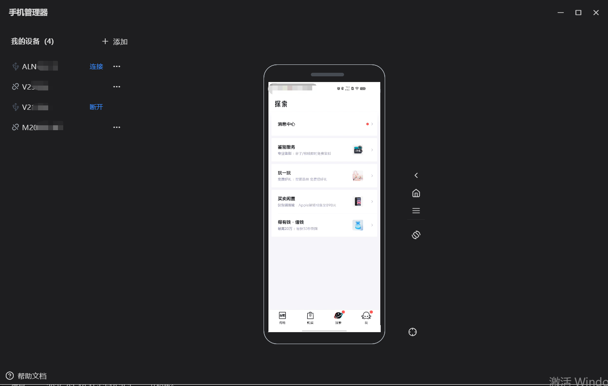
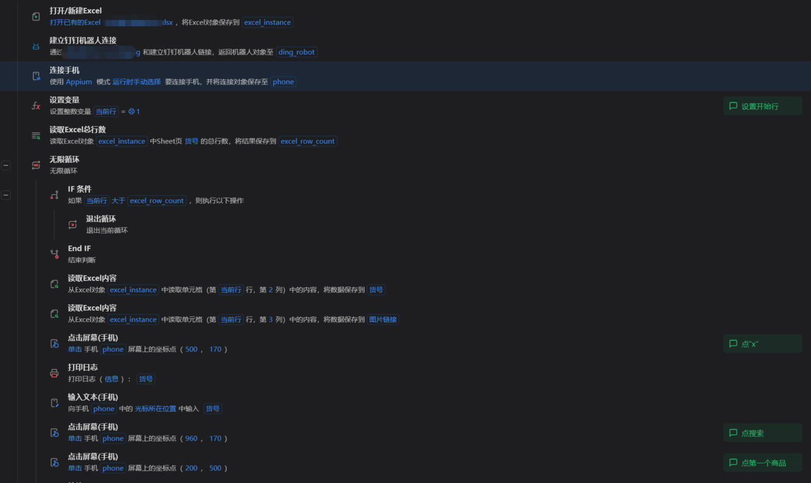
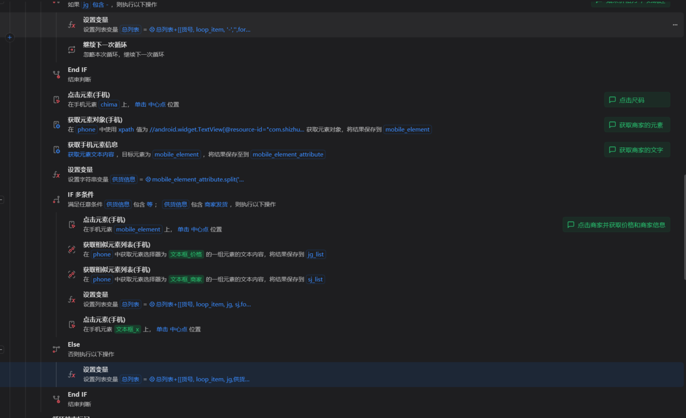
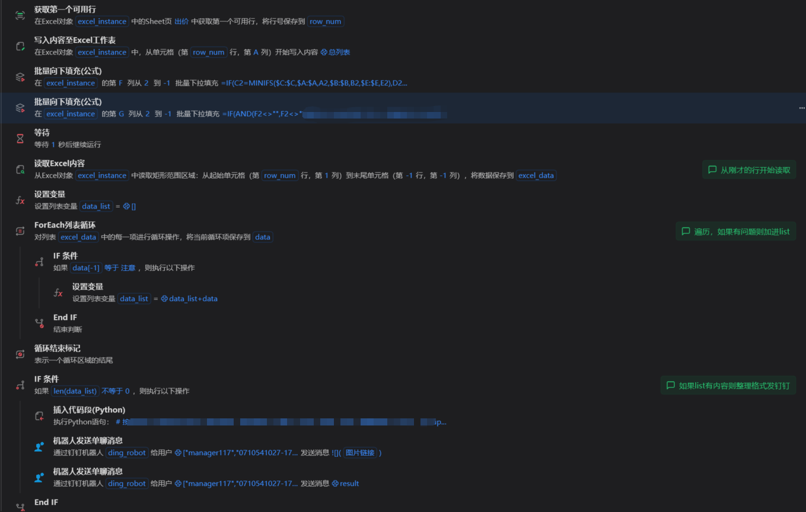
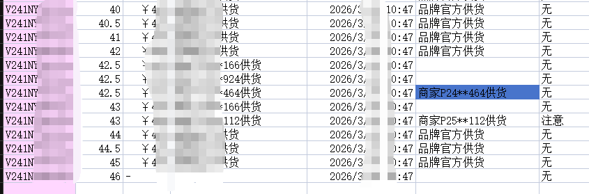
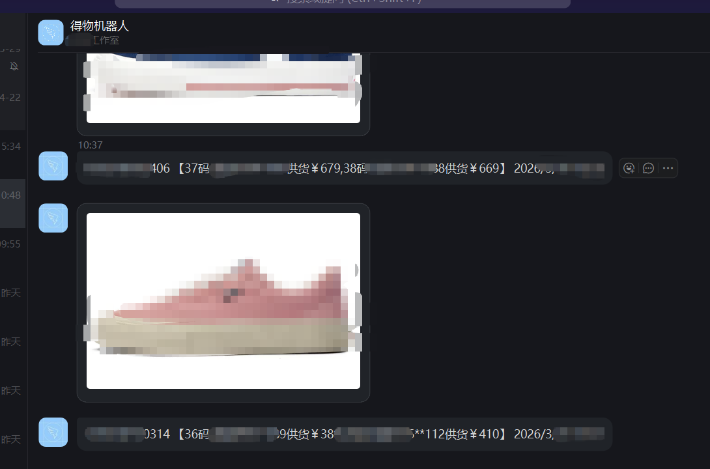

# RPA——手机自动化并发送提示消息到钉钉

## 项目背景

得物平台采用竞价出价机制，消费者选购同款鞋款时，通常优先选择价格更低的商品，而非品牌方官方定价。部分黄牛通过多渠道低价囤货后在平台竞价出售，易导致品牌方商品价格长期处于高位、竞争力不足。因此需对平台重点鞋类商品的出价情况进行每日监控检查，确保品牌方商品价格不会长期偏高，维持市场竞争力。

## 项目思路

针对得物平台反爬机制严格、无网页端的现状，传统接口请求方式易被监测拦截，无法实现数据获取。同时，模拟器运行环境会被平台识别，进而触发账号限制风险，因此本项目采用**真机自动化**方案实现数据采集。

预先在 Excel 表格中录入需重点监控的商品信息，通过真机自动化执行商品出价检查流程，将检查结果与异常信息实时记录至另一 Excel 日志表中。系统自动解析日志数据，识别出价异常商品，通过钉钉机器人推送告警信息至运营人员，运营人员根据告警内容结合实际业务情况，手动完成价格调整。

## 项目实战

连接真机

模拟输入表格的货号，模拟人工操作，获取到每个尺码的商家出价信息

具体思路为搜索货号——点击第一个——点购买——上滑（为了看到商家信息）——循环所有尺码——排除没有价格（即无货）的情况——点击尺码——商家有多个出价点开、单个出价则直接记录——点开后记录所有出价信息——写入excel——辅助列公式填充判断出哪些需要提醒——读取内容——如果有需要提醒的则整理好文本的格式——通过钉钉机器人发送相应信息和图片

