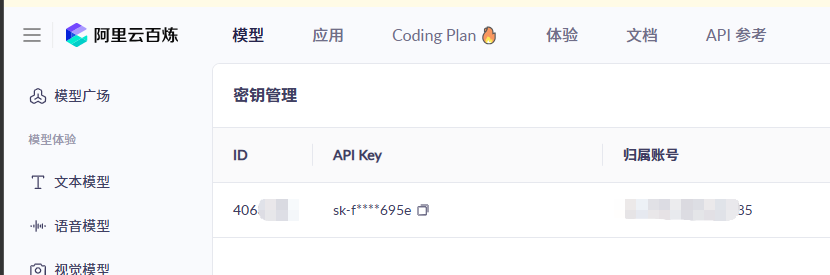
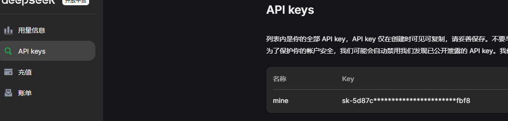
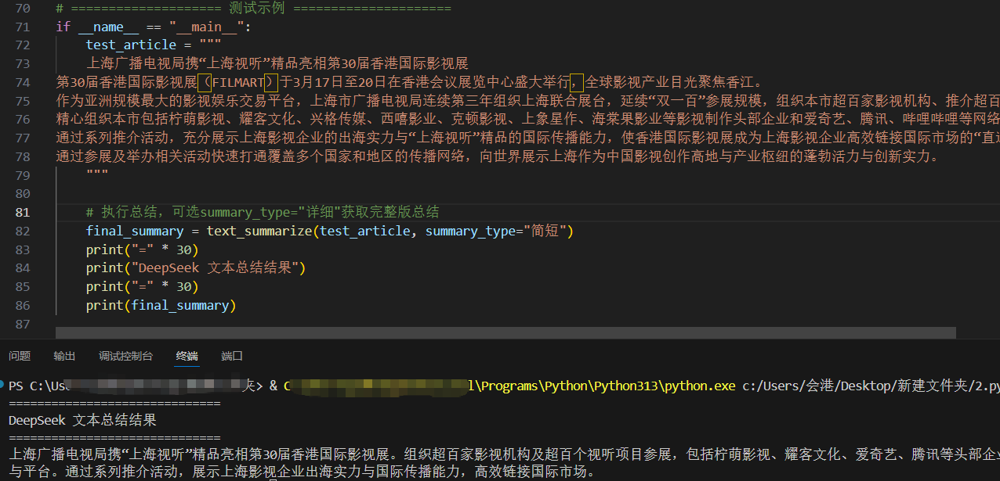
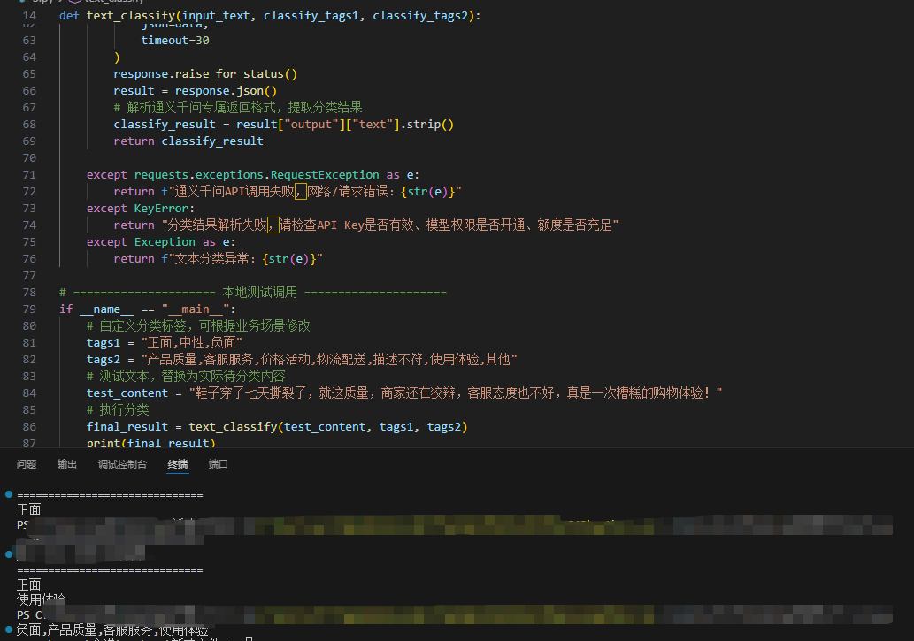

# AI大模型API接入，轻松实现文本总结与分类

在当下职场和技术场景里，**重复的文本处理工作**几乎占据了大部分人的日常：整理会议纪要提炼核心、批量归类文档内容、筛选用户反馈关键词……手动处理不仅效率低，还容易出错，而借助主流AI大模型API，零基础也能快速搭建自动化文本处理工具，彻底解放双手。

作为AI+自动化系列第一篇，本篇全程实操落地，不讲晦涩理论，从API申请、接口调用、参数配置，到文本总结、文本分类的完整代码实现，再到常见问题排查，一步步带你搞定大模型API基础接入，适合程序员、产品、运营、职场效率爱好者学习，看完就能直接用到工作中。

---

## 一、为什么选大模型API做文本处理？

相比于本地部署大模型（硬件要求高、部署繁琐），直接调用第三方大模型API是**成本最低、上手最快、最轻量化**的AI落地方式，核心优势很明显：

- **零硬件门槛**：不需要高配显卡、大内存服务器，普通电脑就能调用，适合个人和小型团队

- **开箱即用**：无需训练模型、优化参数，直接调用成熟接口，几分钟就能出效果

- **功能精准**：针对文本总结、分类这类NLP任务，通用大模型API已经足够精准，满足日常办公需求

- **易集成自动化**：接口调用逻辑固定，后续可直接对接RPA、工作流工具，实现全流程自动化

本次实操选用主流开源/商用大模型API（比如通义千问、文心一言、DeepSeek、GPT-3.5-turbo，任选其一即可），接口逻辑通用，学会一种就能举一反三适配其他平台。

## 二、前期准备：API密钥申请与环境配置

### 2.1 申请大模型API密钥

以国内常用的XX大模型平台为例（替换成你实际选用的平台），申请流程超简单：

1. 注册平台账号，完成实名认证（个人认证即可，免费额度足够日常测试）

2. 进入控制台-API密钥管理，新建密钥，保存好**API Key**和**Secret Key/接口地址**（apikey建议保存到环境变量，避免暴露）

3. 查看平台API文档，确认文本对话接口的调用格式、参数要求、免费额度限制





**新手小贴士**：优先选有免费调用额度的平台，初期测试完全够用，避免产生额外费用；密钥建议存放在环境变量中，不要直接硬编码到代码里。

### 2.2 本地开发环境配置

本次用Python做实操（语法简洁、库丰富，最适合API快速开发），只需安装一个依赖库即可：

```bash
# 安装requests库，用于发送HTTP请求
pip install requests
```

编辑器推荐：VS Code、PyCharm，随便一款都能满足需求，不需要复杂配置。


## 三、核心知识点：API调用基础逻辑

大模型文本类API本质是**HTTP接口调用**，核心流程固定：

1. 构造请求头：携带API密钥做身份验证

2. 构造请求体：传入指令（prompt）、待处理文本、模型参数（温度、最大长度等）

3. 发送POST请求到接口地址

4. 接收返回结果，解析提取需要的文本总结/分类内容

针对文本总结和分类，我们只需要定制不同的prompt指令，就能让模型输出对应结果，不需要改动核心调用代码。


## 四、实战一：AI文本总结功能实现

### 4.1 功能需求

系统支持对各类长文本（如用户评价、公告、文章、报告等）进行自动摘要提取，快速提炼核心内容、关键信息与主要观点，降低人工阅读成本，提高信息处理效率。

### 4.2 核心代码实现

（使用DeepSeek）

```python
import requests
import os

# ===================== DeepSeek API 专属配置 =====================
# 从环境变量读取密钥，严禁硬编码，避免泄露被盗刷
# 本地测试可临时赋值，正式使用务必改用环境变量
DEEPSEEK_API_KEY = os.getenv("DEEPSEEK_API_KEY")
DEEPSEEK_API_URL = "https://api.deepseek.com/v1/chat/completions"
# 选用DeepSeek轻量高效模型，适合文本总结，成本低响应快
MODEL_NAME = "deepseek-chat"

# ===================== 文本总结核心函数 =====================
def text_summarize(input_text, summary_type="简短"):
    """
    调用DeepSeek API实现文本总结
    :param input_text: 待总结的原始文本
    :param summary_type: 总结类型，可选「简短/详细」
    :return: 纯文本总结结果，异常返回错误提示
    """
    # DeepSeek专属优化Prompt，指令更精准，强制输出纯总结，无多余话术
    prompt = f"""请你严格按照要求完成文本{summary_type}总结，仅保留核心信息、关键数据和核心结论，语言凝练通顺，无冗余修饰、无额外解释、无开头结尾话术，直接输出总结内容即可，不要添加任何无关文字。
    待总结文本：{input_text}
    """

    # 请求头配置，DeepSeek仅需API Key做Bearer认证，无需Secret Key
    headers = {
        "Content-Type": "application/json",
        "Authorization": f"Bearer {DEEPSEEK_API_KEY}"
    }

    # 请求体参数，适配DeepSeek官方接口规范
    data = {
        "model": MODEL_NAME,
        "messages": [
            {"role": "system", "content": "你是专业的文本处理助手，擅长精准提炼文本核心内容，输出简洁规范的总结"},
            {"role": "user", "content": prompt}
        ],
        # 温度值设为0.1，结果更稳定精准，适合总结、分类等理性任务
        "temperature": 0.1,
        # 最大输出token数，控制总结长度，避免过长冗余
        "max_tokens": 600,
        # 禁止模型输出重复内容
        "frequency_penalty": 0.0
    }

    try:
        # 发送POST请求，设置30秒超时，避免程序卡死
        response = requests.post(
            DEEPSEEK_API_URL,
            headers=headers,
            json=data,
            timeout=30
        )
        # 主动抛出HTTP请求异常
        response.raise_for_status()
        result = response.json()
        # 解析DeepSeek返回结果，提取纯总结内容
        summary_content = result["choices"][0]["message"]["content"].strip()
        return summary_content

    except requests.exceptions.RequestException as e:
        return f"DeepSeek API调用失败，网络/请求错误：{str(e)}"
    except KeyError:
        return "结果解析失败，请检查API密钥是否有效、额度是否充足"
    except Exception as e:
        return f"文本总结异常：{str(e)}"

# ==================== 测试示例 =====================
if __name__ == "__main__":
    test_article = """
    上海广播电视局携“上海视听”精品亮相第30届香港国际影视展
第30届香港国际影视展（FILMART）于3月17日至20日在香港会议展览中心盛大举行，全球影视产业目光聚焦香江。
作为亚洲规模最大的影视娱乐交易平台，上海市广播电视局连续第三年组织上海联合展台，延续“双一百”参展规模，组织本市超百家影视机构、推介超百个优秀视听项目，
精心组织本市包括柠萌影视、耀客文化、兴格传媒、西嘻影业、克顿影视、上象星作、海棠果影业等影视制作头部企业和爱奇艺、腾讯、哔哩哔哩等网络平台参展，
通过系列推介活动，充分展示上海影视企业的出海实力与“上海视听”精品的国际传播能力，使香港国际影视展成为上海影视企业高效链接国际市场的“直通车”，
通过参展及举办相关活动快速打通覆盖多个国家和地区的传播网络，向世界展示上海作为中国影视创作高地与产业枢纽的蓬勃活力与创新实力。

    """

    # 执行总结，可选summary_type="详细"获取完整版总结
    final_summary = text_summarize(test_article, summary_type="简短")
    print("=" * 30)
    print("DeepSeek 文本总结结果")
    print("=" * 30)
    print(final_summary)

```

### 4.3 代码说明与效果演示

代码中重点参数解析：

- **temperature**：设为0.1-0.3，避免模型天马行空，保证总结精准客观

- **prompt指令**：明确要求“直接输出结果，不要额外解释”，减少无效内容

- **异常处理**：加入超时、请求失败捕获，避免程序直接崩溃

测试效果输出示例：

 

## 五、实战二：AI文本分类功能实现

### 5.1 功能需求

构建用户评价智能处理功能，实现评价自动情绪判定、问题归因分类，输出标准化回复话术；同时支持评价问题统计分析，形成数据总结，助力产品与服务优化，降低同类问题重复发生。

### 5.2核心代码实现

（使用阿里云通义千问）

```python
import requests
import os

# 通义千问需配置API Key，本地测试可临时赋值，正式用环境变量
DASHSCOPE_API_KEY = os.getenv("DASHSCOPE_API_KEY")
# 通义千问官方聊天接口地址，固定无需修改
QWEN_API_URL = "https://dashscope.aliyuncs.com/api/v1/services/aigc/text-generation/generation"
# 选用通义千问轻量版，响应快、成本低，适合文本分类任务
MODEL_NAME = "qwen-turbo"

# ===================== 文本分类核心函数 =====================
def text_classify(input_text, classify_tags1, classify_tags2):
    """
    调用通义千问API实现精准文本分类
    :param input_text: 待分类原始文本
    :param classify_tags: 自定义分类标签，用逗号分隔
    :return: 唯一分类标签，异常返回直白报错提示
    """
    # 通义千问专属优化Prompt，严格限定输出规则，杜绝歧义
    prompt = f"""请你严格完成文本分类任务，遵守以下规则：
    1. 只能从下方给定的分类标签1中选择一个，禁止自主新增标签
    2. 可以从下方给定的分类标签2中选择一个或多个，禁止自主新增标签
    2. 只输出最终分类标签，不添加任何解释、修饰、标点和无关文字
    3. 分类结果精准唯一，不模糊归类
    可选分类标签1：{classify_tags1}
    可选分类标签2：{classify_tags2}
    待分类文本：{input_text}
    """

    # 通义千问专属请求头配置，携带API Key做身份校验
    headers = {
        "Content-Type": "application/json",
        "Authorization": f"Bearer {DASHSCOPE_API_KEY}"
    }

    # 通义千问专属请求体格式，严格适配官方规范
    data = {
        "model": MODEL_NAME,
        "input": {
            "messages": [
                {"role": "system", "content": "你是专业的文本分类助手，分类精准、输出规范，严格按照指令执行"},
                {"role": "user", "content": prompt}
            ]
        },
        "parameters": {
            # 温度设为0.1，结果稳定不跑偏，适合分类这类理性任务
            "temperature": 0.1,
            # 限制最大输出长度，仅输出分类标签即可
            "max_tokens": 50,
            # 关闭流式输出，直接返回完整结果
            "stream": False
        }
    }

    try:
        # 发送请求，设置30秒超时，避免程序卡死
        response = requests.post(
            QWEN_API_URL,
            headers=headers,
            json=data,
            timeout=30
        )
        response.raise_for_status()
        result = response.json()
        # 解析通义千问专属返回格式，提取分类结果
        classify_result = result["output"]["text"].strip()
        return classify_result

    except requests.exceptions.RequestException as e:
        return f"通义千问API调用失败，网络/请求错误：{str(e)}"
    except KeyError:
        return "分类结果解析失败，请检查API Key是否有效、模型权限是否开通、额度是否充足"
    except Exception as e:
        return f"文本分类异常：{str(e)}"

# ===================== 本地测试调用 =====================
if __name__ == "__main__":
    # 自定义分类标签，可根据业务场景修改
    tags1 = "正面,中性,负面"
    tags2 = "产品质量,客服服务,价格活动,物流配送,描述不符,使用体验,其他"
    # 测试文本，替换为实际待分类内容
    test_content = "鞋子穿了七天撕裂了，就这质量，商家还在狡辩，客服态度也不好，真是一次糟糕的购物体验！"
    # 执行分类
    final_result = text_classify(test_content, tags1, tags2)
    print(final_result)

```

### 5.3 分类效果说明

测试文本输出结果



prompt的核心技巧：**必须限定分类范围，禁止模型自主新增标签**，同时要求直接输出结果，这样分类准确率极高，完全满足批量文本处理需求。

## 六、常见问题与避坑指南

**高频问题解决方案**

- 密钥报错/无权限：检查密钥是否正确、是否开启API权限、实名认证是否完成

- 请求超时：更换网络，或增加timeout时长，部分境外平台需要特殊网络配置

- 结果不准确：优化prompt，更明确指令要求，降低temperature参数

- 额度耗尽：切换免费额度平台，或充值小额费用，日常办公调用成本极低

- 代码报错：核对接口请求格式，不同平台的请求体字段略有差异，严格对照官方文档
