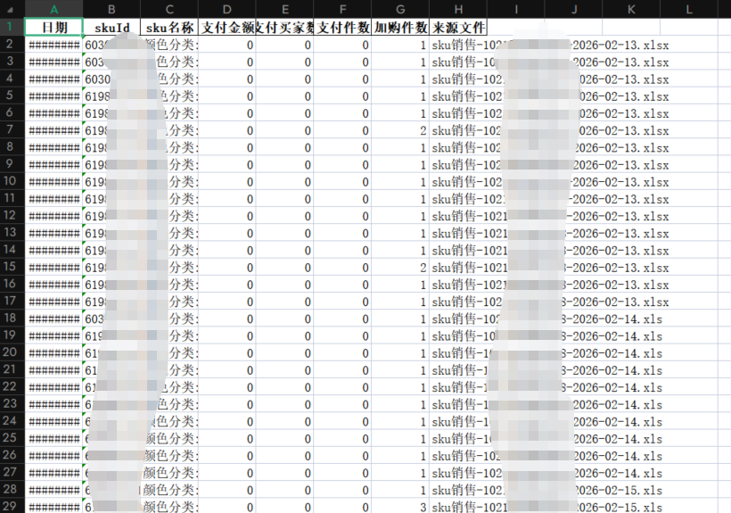
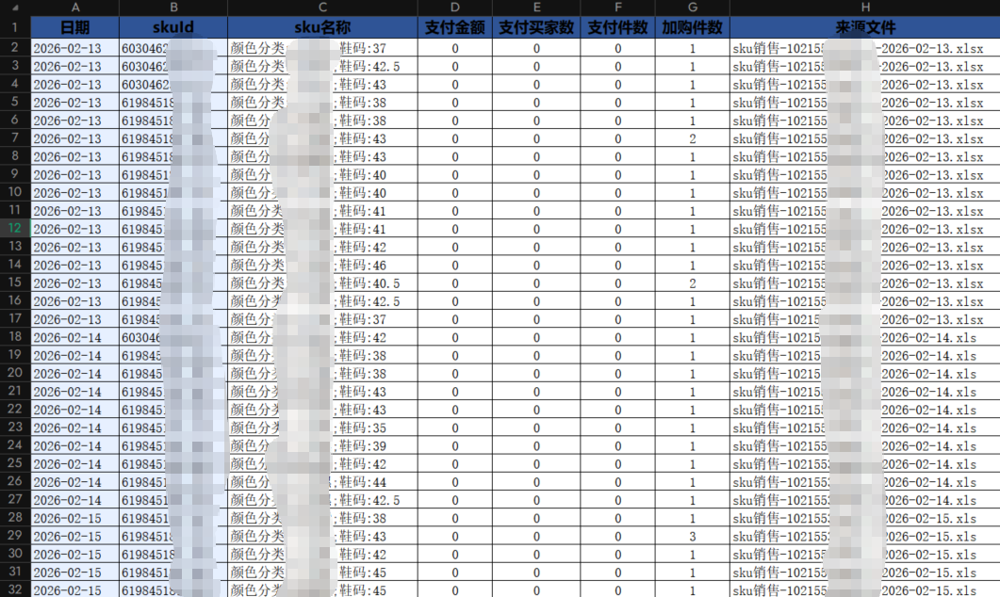

# 打造Excel 报表：Python 自动化美化

在上一篇文章中，我们分享了如何用 Python 完成 Excel 数据的清洗与合并，今天我们聚焦于更能体现专业性的环节 ——Excel 报表的自动化美化。手动调整 Excel 样式不仅耗时耗力，还容易出现格式不统一的问题，通过 Python 的 openpyxl 库结合 pandas，我们可以一键生成格式规范、视觉美观的专业报表，彻底告别重复的手工操作。

### 需求

下图为上篇文章生成的文件，可以看见只是把这些文件合并起来了，但每一列宽度都一样，遮挡了很多内容，而且样式不好看



下图为本篇文章后做成的效果（可以高度自定义）



## 一、核心需求分析

一份专业的 Excel 报表，需要满足这些样式要求：

1. 表头醒目：统一的字体、背景色、对齐方式
2. 数据规范：数值列居中、文本列左对齐，关键列标色区分
3. 格式正确：日期列统一格式、skuId 避免科学计数法
4. 布局合理：列宽自适应，兼顾中英文字符显示
5. 边框完整：所有单元格添加细边框，提升整洁度

## 二、技术选型

- pandas：读取 / 写入 Excel 数据，快速处理列索引
- openpyxl：精细化设置 Excel 单元格样式（字体、颜色、对齐、格式、边框）
- os：校验文件路径有效性

## 三、核心代码实现与解析

### 1. 函数封装与文件校验

```python
import pandas as pd
import os
from openpyxl.styles import Font, PatternFill, Border, Side, Alignment
from openpyxl.utils import get_column_letter

def beautify_excel(input_excel, output_excel):
    """
    给Excel报表添加专业样式美化（含列宽自适应）
    :param input_excel: 清洗后Excel文件路径
    :param output_excel: 美化后的Excel文件路径
    """
    # 校验输入文件
    if not os.path.exists(input_excel):
        print(f"错误：未找到输入文件 {input_excel}")
        return

    try:
        df = pd.read_excel(input_excel, engine='openpyxl')
    except Exception as e:
        print(f"读取文件失败：{str(e)}")
        return
```

### 2. 样式模板定义

提前定义好各类样式模板，便于统一管理和修改，符合 “一次定义、多处复用” 的原则：

```python
# 写入Excel并设置样式
with pd.ExcelWriter(output_excel, engine='openpyxl') as writer:
    df.to_excel(writer, sheet_name='清洗合并数据', index=False)
    workbook = writer.book
    worksheet = writer.sheets['清洗合并数据']

    # 定义样式模板
    header_font = Font(name='微软雅黑', size=12, bold=True, color="000000") # 表头字体
    header_fill = PatternFill(start_color="2F5496", end_color='2F5496', fill_type='solid') # 表头背景色（深蓝色）
    header_align = Alignment(horizontal='center', vertical='center', wrap_text=True) # 表头对齐方式
    # 细边框样式（全局统一）
    thin_border = Border(
        left=Side(style='thin', color='000000'),
        right=Side(style='thin', color='000000'),
        top=Side(style='thin', color='000000'),
        bottom=Side(style='thin', color='000000')
    )
    key_col_fill = PatternFill(start_color='E7F0FF', end_color='E7F0FF', fill_type='solid') # 关键列背景色（浅蓝色）
    num_align = Alignment(horizontal='center', vertical='center') # 数值列对齐
    text_align = Alignment(horizontal='left', vertical='center') # 文本列对齐
```

### 3. 表头样式设置

给表头行应用预设的样式模板，让表头醒目且统一：

```python
# 设置表头样式
for col in worksheet.iter_cols(min_row=1, max_row=1):
    for cell in col:
        cell.font = header_font
        cell.fill = header_fill
        cell.alignment = header_align
        cell.border = thin_border
```

### 4. 数据行样式精细化控制

#### （1）数值 / 文本列对齐区分

根据列类型自动设置对齐方式，数值列居中、文本列左对齐，符合阅读习惯：

```python
# 定义列类型
max_row = worksheet.max_row
max_col = worksheet.max_column
num_cols = ['加购件数', '支付金额', '支付买家数','支付件数']

# 设置数据行样式
for row in worksheet.iter_rows(min_row=2, max_row=max_row, min_col=1, max_col=max_col):
    for cell in row:
        cell.border = thin_border
        col_name = df.columns[cell.column - 1]
        # 数值列居中，文本列左对齐
        if col_name in num_cols:
                    cell.alignment = num_align
                else:
                    cell.alignment = text_align
```

#### （2）关键列标色突出

给日期、skuId 核心列添加浅蓝色背景，快速定位关键信息：

```python
key_cols = ['日期', 'skuId']
# 关键列标色
for col in worksheet.iter_cols(min_row=2, max_row=max_row, min_col=1, max_col=max_col):
    col_name = df.columns[col[0].column - 1]
    if col_name in key_cols:
        for cell in col:
            cell.fill = key_col_fill
```

### 5. 特殊列格式处理（难点）

#### （1）日期列统一格式

确保日期列以`yyyy-mm-dd`格式显示，避免格式混乱：

**不设置的话会导致日期和时间都显示**

```python
if '日期' in df.columns:
    date_col_idx = df.columns.get_loc('日期') + 1
    for cell in worksheet.iter_cols(min_col=date_col_idx, max_col=date_col_idx, min_row=2, max_row=max_row):
        for c in cell:
            c.number_format = 'yyyy-mm-dd'
```

#### （2）skuId 避免科学计数法

skuId 作为标识列，设置为文本格式，防止长数字被自动转为科学计数法：

**这里需要设置格式为自定义的0格式，只设置成文本的话，还是显示成科学计数法**

```python
if 'skuId' in df.columns:
    sku_col_idx = df.columns.get_loc('skuId') + 1
    # 设置该列的单元格格式为文本
    for row in range(2, max_row + 1):
        cell = worksheet.cell(row=row, column=sku_col_idx)
        cell.number_format = '0'
        cell.alignment = Alignment(horizontal='left', vertical='center')
        cell.border = thin_border
```

### 6. 列宽自适应（难点）

通过计算单元格内容长度（区分中英文字符），实现列宽自动适配：

**需要考虑中英文字符，而且日期列读取的还是为长日期，需要做单独的处理**

```python
# 列宽自适应（考虑中英文字符宽度和日期格式）
date_column_letter = None
if df is not None and '日期' in df.columns:
    date_col_idx = df.columns.get_loc('日期') + 1
    date_column_letter = worksheet.cell(row=1, column=date_col_idx).column_letter

for col in worksheet.columns:
    max_length = 0
    column_letter = col[0].column_letter
    
    for cell in col:
        if cell.value is None:
            cell_length = 0
        else:
            # 特殊处理日期列：按格式化后的显示长度计算
            if column_letter == date_column_letter and isinstance(cell.value, pd.Timestamp):
                cell_content = cell.value.strftime('%Y-%m-%d')
                cell_length = len(cell_content)  # 固定为10
            else:
                # 普通单元格：区分中英文计算长度（中文占2个字符，英文占1个）
                cell_content = str(cell.value)
                cell_length = 0
                for char in cell_content:
                    if '\u4e00' <= char <= '\u9fff':
                        cell_length += 2
                    else:
                        cell_length += 1
        
        if cell_length > max_length:
            max_length = cell_length
    
    # 调整列宽（预留3个字符的边距）
    adjusted_width = max_length + 3
    worksheet.column_dimensions[column_letter].width = adjusted_width
    print(f"列 {column_letter} 最终调整宽度：{adjusted_width}（最大内容长度：{max_length}）")
```

### 7. 函数调用示例

```python
if __name__ == "__main__":
    # 请修改为实际的文件路径
    input_file = "C:/Users/xx/Downloads/清洗后的合并数据.xlsx"
    output_file = "C:/Users/xx/Downloads/带样式_清洗后的合并数据.xlsx"
    beautify_excel(input_file, output_file)
```

## 四、最终效果与价值

### 1. 视觉效果

- 表头：深蓝色背景 + 微软雅黑加粗字体，居中对齐
- 数据：数值列居中、文本列左对齐，关键列浅蓝色标色
- 格式：日期统一为`yyyy-mm-dd`，skuId 无科学计数法
- 布局：列宽自适应，无内容截断 / 留白过多问题

### 2. 核心价值

- 效率提升：一键完成所有样式设置，替代数十分钟的手工操作
- 格式统一：避免多人操作导致的样式不一致问题
- 可复用性：修改样式模板即可适配不同业务的报表需求
- 容错性：包含文件校验、异常处理，降低使用门槛

## 五、扩展与优化建议

1. 样式配置化：将字体、颜色等样式参数抽离到配置文件，无需修改代码即可调整样式
2. 多 sheet 支持：扩展函数以支持多个工作表的批量美化
3. 条件格式：添加数值预警（如支付金额低于阈值标红）等条件格式
4. 批量处理：遍历文件夹实现多 Excel 文件的批量美化
5. 样式预览：生成样式预览图，确认效果后再输出文件

## 总结

通过 Python 结合 pandas 和 openpyxl，我们不仅能完成数据的清洗处理，还能实现 Excel 报表的 “工业化” 美化。这份自动化脚本可以作为数据分析的通用工具，将分析师从重复的手工操作中解放出来，把精力聚焦在数据解读和业务洞察上。下一篇我们将分享如何把这些脚本封装为可视化工具，让非技术人员也能轻松使用！