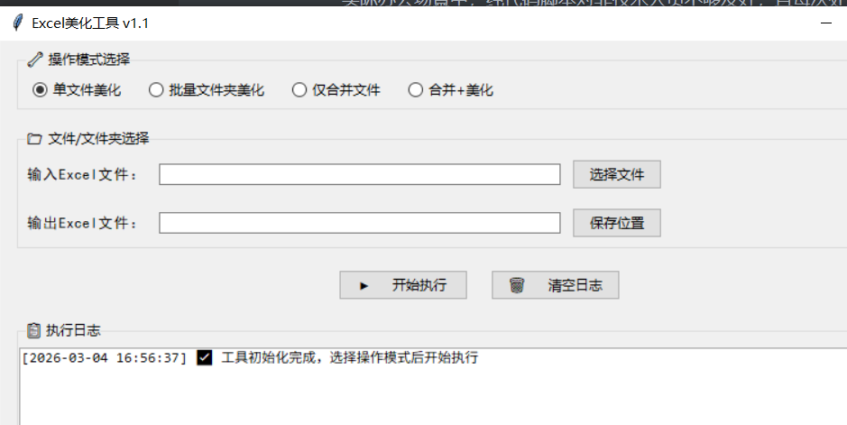
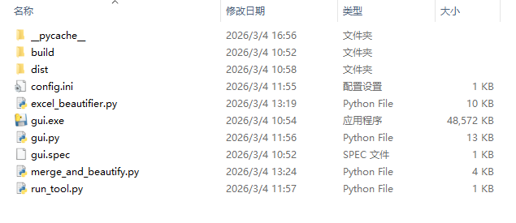

# Python Excel 自动化终极篇：打造可复用的批量美化工具（附可视化操作界面）

### 需求

在前两篇文章中，我们依次实现了 Excel 数据的批量合并清洗、单文件样式美化，解决了从 “杂乱数据” 到 “规范报表” 的核心需求。但在实际办公场景中，纯代码脚本对非技术人员不够友好，且每次处理不同文件 / 样式都要修改代码，复用性不足。

本篇作为 Excel 自动化系列的终极篇，我们将把前两篇的核心功能封装为**可复用的批量处理工具**，添加可视化操作界面（GUI），支持多文件批量处理、样式自定义配置，让技术和非技术人员都能一键搞定 Excel 报表美化，真正落地到日常办公中。本文将详细介绍如何基于 Python 开发一款集「单文件美化」「批量文件夹美化」「文件合并」「合并 + 美化」于一体的 Excel 美化工具，涵盖核心逻辑实现、配置化管理、GUI 界面封装全流程。

效果如下





## 一、工具核心亮点

1. **可视化操作**：基于 tkinter 打造图形界面，无需写代码，点击选择文件 / 文件夹即可操作
2. **批量处理**：支持单文件 / 多文件 / 整个文件夹的 Excel 批量美化，效率翻倍
3. **样式可配置**：内置样式配置文件，修改参数即可自定义表头颜色、关键列、对齐方式等
4. **格式智能适配**：自动识别日期列、长数字列，避免科学计数法、日期带时间等问题
5. **容错性强**：完善的文件校验、异常提示，操作出错时给出清晰指引
6. **即开即用**：打包为 exe 可执行文件，无需安装 Python 环境，全平台兼容

## 二、技术栈升级

在原有 pandas+openpyxl 基础上，新增：

- **tkinter**：Python 内置的 GUI 库，打造可视化操作界面，零额外依赖
- **configparser**：读取样式配置文件，实现样式与代码解耦
- **glob**：遍历文件夹，实现多文件批量处理
- **tkinter.filedialog**：文件 / 文件夹选择对话框，简化操作流程

## 三、完整工具代码实现

### 1.config.ini（配置文件）

配置文件，定义 Excel 美化的样式规则：

|          配置项          |                        作用                        |
| :----------------------: | :------------------------------------------------: |
|        `header_*`        |       表头字体、字号、加粗、字体颜色、背景色       |
|    `key_col_bg_color`    |            关键列（日期、skuId）背景色             |
|   `key_cols/num_cols`    |   标记关键列、数值列（用于区分样式 / 对齐方式）    |
|   `min/max_col_width`    |      列宽的最小 / 最大值，`margin`是列宽余量       |
| `date_format/sku_format` | 日期、SKU 的显示格式（SKU 设为文本避免科学计数法） |

**完整代码**

```ini
[STYLE]
# 表头样式
header_font = 微软雅黑
header_font_size = 12
header_font_bold = True
header_font_color = FFFFFF
header_bg_color = 2F5496


# 关键列样式
key_col_bg_color = E7F0FF
key_cols = 日期,skuId

# 数值列（居中对齐）
num_cols = 加购件数,支付金额,支付买家数,支付件数

# 列宽配置（适配中英文混合计算）
min_col_width = 8
max_col_width = 50
margin = 3

# 格式配置
date_format = yyyy-mm-dd
sku_format = 0
```


### 2.excel_beautifier.py（核心美化逻辑）

核心类：`ExcelBeautifier`，封装所有 Excel 样式美化逻辑

|       函数 / 方法        |                             作用                             |
| :----------------------: | :----------------------------------------------------------: |
| `__init__(config_path)`  |      初始化：读取配置文件，调用`_init_styles()`加载样式      |
|     `_init_styles()`     | 从配置文件解析样式（字体、填充、对齐、列宽、列类型等），初始化类属性 |
| `_calculate_col_width()` | 计算列宽（区分中英文：中文占 2 字符、英文占 1 字符；日期列固定 10 字符），限制最小 / 最大值 |
| `beautify_single_file()` | 单文件美化主逻辑：<br />1. 校验文件格式并读取<br />2. 写入 Excel 并设置表头样式<br />3. 数据行样式（数值列居中、文本列左对齐）<br />4. 关键列标色<br /><br />5. 日期 / SKU 格式处理6. 调用列宽计算并应用 |
| `beautify_batch_files()` | 批量美化：遍历文件夹下所有 Excel，调用`beautify_single_file()`逐个处理 |

**完整代码**

```python
import pandas as pd
import os
import configparser
from openpyxl.styles import Font, PatternFill, Border, Side, Alignment
from openpyxl.utils import get_column_letter

class ExcelBeautifier:
    def __init__(self, config_path="config.ini"):
        # 读取配置文件
        self.config = configparser.ConfigParser()
        if not os.path.exists(config_path):
            raise FileNotFoundError(f"配置文件 {config_path} 不存在")
        self.config.read(config_path, encoding="utf-8")
        self._init_styles()

    def _init_styles(self):
        """初始化样式模板（从配置文件读取）"""
        # 表头样式
        self.header_font = Font(
            name=self.config.get("STYLE", "header_font", fallback="微软雅黑"),
            size=int(self.config.get("STYLE", "header_font_size", fallback=12)),
            bold=self.config.getboolean("STYLE", "header_font_bold", fallback=True),
            color=self.config.get("STYLE", "header_font_color", fallback="FFFFFF")
        )
        self.header_fill = PatternFill(
            start_color=self.config.get("STYLE", "header_bg_color", fallback="2F5496"),
            end_color=self.config.get("STYLE", "header_bg_color", fallback="2F5496"),
            fill_type="solid"
        )
        self.header_align = Alignment(horizontal="center", vertical="center", wrap_text=True)
        
        # 全局边框
        self.thin_border = Border(
            left=Side(style="thin", color="000000"),
            right=Side(style="thin", color="000000"),
            top=Side(style="thin", color="000000"),
            bottom=Side(style="thin", color="000000")
        )
        
        # 关键列样式
        self.key_col_fill = PatternFill(
            start_color=self.config.get("STYLE", "key_col_bg_color", fallback="E7F0FF"),
            end_color=self.config.get("STYLE", "key_col_bg_color", fallback="E7F0FF"),
            fill_type="solid"
        )
        
        # 对齐方式
        self.num_align = Alignment(horizontal="center", vertical="center")
        self.text_align = Alignment(horizontal="left", vertical="center")
        
        # 列宽配置
        self.min_col_width = int(self.config.get("STYLE", "min_col_width", fallback=8))
        self.max_col_width = int(self.config.get("STYLE", "max_col_width", fallback=50))
        self.margin = int(self.config.get("STYLE", "margin", fallback=3))
        
        # 格式配置
        self.date_format = self.config.get("STYLE", "date_format", fallback="yyyy-mm-dd")
        self.sku_format = self.config.get("STYLE", "sku_format", fallback="@")
        
        # 列类型配置
        self.key_cols = [col.strip() for col in self.config.get("STYLE", "key_cols", fallback="日期,skuId").split(",")]
        self.num_cols = [col.strip() for col in self.config.get("STYLE", "num_cols", fallback="加购件数,支付金额").split(",")]

    def _calculate_col_width(self, worksheet, df):
        """列宽计算逻辑（区分中英文/日期格式）"""
        # 定位日期列
        date_column_letter = None
        if '日期' in df.columns:
            date_col_idx = df.columns.get_loc('日期') + 1
            date_column_letter = get_column_letter(date_col_idx)

        # 遍历所有列计算宽度
        for col in worksheet.columns:
            max_length = 0
            column_letter = get_column_letter(col[0].column)
            
            for cell in col:
                if cell.value is None:
                    cell_length = 0
                else:
                    # 特殊处理日期列：按格式化后的长度计算（固定10）
                    if column_letter == date_column_letter:
                        try:
                            cell_value = pd.to_datetime(cell.value)
                            cell_content = cell_value.strftime('%Y-%m-%d')
                            cell_length = len(cell_content)
                        except:
                            cell_content = str(cell.value)
                            cell_length = sum(2 if '\u4e00' <= c <= '\u9fff' else 1 for c in cell_content)
                    else:
                        # 区分中英文计算长度（中文占2个字符，英文占1个）
                        cell_content = str(cell.value)
                        cell_length = sum(2 if '\u4e00' <= c <= '\u9fff' else 1 for c in cell_content)
            
                if cell_length > max_length:
                    max_length = cell_length
        
            # 调整列宽（限制最大/最小值）
            adjusted_width = max_length + self.margin
            adjusted_width = max(adjusted_width, self.min_col_width)
            adjusted_width = min(adjusted_width, self.max_col_width)
            worksheet.column_dimensions[column_letter].width = adjusted_width

    def beautify_single_file(self, input_file, output_file):
        """美化单个Excel文件"""
        # 文件校验
        if not os.path.exists(input_file):
            return False, f"错误：文件 {input_file} 不存在"
        
        try:
            # 根据后缀选择读取引擎
            if input_file.lower().endswith('.xlsx'):
                df = pd.read_excel(input_file, engine="openpyxl")
            elif input_file.lower().endswith('.xls'):
                df = pd.read_excel(input_file, engine="xlrd")
            else:
                return False, f"错误：不支持的文件格式 {input_file}"
        except Exception as e:
            return False, f"读取文件失败：{str(e)}"
        
        # 写入Excel并美化
        try:
            with pd.ExcelWriter(output_file, engine="openpyxl") as writer:
                df.to_excel(writer, sheet_name="清洗合并数据", index=False)
                ws = writer.sheets["清洗合并数据"]
                
                # 1. 设置表头样式
                for cell in ws[1]:
                    cell.font = self.header_font
                    cell.fill = self.header_fill
                    cell.alignment = self.header_align
                    cell.border = self.thin_border
                
                # 2. 设置数据行样式（区分数值/文本列对齐）
                max_row = ws.max_row
                max_col = ws.max_column
                for row in ws.iter_rows(min_row=2, max_row=max_row, min_col=1, max_col=max_col):
                    for cell in row:
                        cell.border = self.thin_border
                        col_name = df.columns[cell.column - 1]
                        if col_name in self.num_cols:
                            cell.alignment = self.num_align
                        else:
                            cell.alignment = self.text_align
                
                # 3. 关键列标色
                for col in ws.iter_cols(min_row=2, max_row=max_row, min_col=1, max_col=max_col):
                    col_name = df.columns[col[0].column - 1]
                    if col_name in self.key_cols:
                        for cell in col:
                            cell.fill = self.key_col_fill
                
                # 4. 特殊列格式处理
                # 日期列
                if '日期' in df.columns:
                    date_col_idx = df.columns.get_loc('日期') + 1
                    for cell in ws.iter_cols(min_col=date_col_idx, max_col=date_col_idx, min_row=2, max_row=max_row):
                        for c in cell:
                            c.number_format = self.date_format
                # skuId列（强制文本）
                if 'skuId' in df.columns:
                    sku_col_idx = df.columns.get_loc('skuId') + 1
                    for row in range(2, max_row + 1):
                        cell = ws.cell(row=row, column=sku_col_idx)
                        cell.number_format = self.sku_format
                        cell.alignment = self.text_align
                        cell.border = self.thin_border
                
                # 5. 列宽自适应
                self._calculate_col_width(ws, df)
            
            return True, f"成功：{output_file}"
        except Exception as e:
            return False, f"美化失败：{str(e)}"

    def beautify_batch_files(self, input_dir, output_dir):
        """批量美化文件夹下的所有Excel文件"""
        if not os.path.exists(input_dir):
            return False, f"错误：文件夹 {input_dir} 不存在"
        
        os.makedirs(output_dir, exist_ok=True)
        excel_files = [f for f in os.listdir(input_dir) if (f.endswith(".xlsx") or f.endswith(".xls")) and not f.startswith('~$')]
        
        if not excel_files:
            return False, "错误：文件夹中未找到有效Excel文件"
        
        # 遍历文件夹下所有 Excel，调用beautify_single_file()逐个处理
        result = []
        for file in excel_files:
            input_path = os.path.join(input_dir, file)
            output_path = os.path.join(output_dir, f"美化_{file}")
            success, msg = self.beautify_single_file(input_path, output_path)
            result.append(f"{file}：{msg}")
        
        return True, "\n".join(result)
```


### 3.merge_and_beautify.py（数据合并 + 清洗）

|          函数          |                             作用                             |
| :--------------------: | :----------------------------------------------------------: |
| `merge_excel_files()`  | 批量合并 Excel 并清洗：<br />1. 遍历文件夹，跳过前 5 行读取 Excel<br />2. 给数据标记来源文件<br />3. 合并所有数据并填充空值<br />4. 处理 SKU 格式（去`.0`）<br />5. 从文件名提取日期并移到第一列<br />6. 过滤无效数据（加购件数≥0）<br />7. 保存清洗后的合并文件 |
| `merge_and_beautify()` | 一站式合并 + 美化：<br />1. 调用`merge_excel_files()`合并清洗<br />2. 调用`ExcelBeautifier`美化合并后的文件 |

**完整代码**

```python
import os
import pandas as pd
from excel_beautifier import ExcelBeautifier

def merge_excel_files(folder_path, merge_output_file):
    """批量读取文件夹下的Excel文件并做数据清洗"""
    all_data = []
    # 遍历文件夹中的所有Excel文件
    for filename in os.listdir(folder_path):
        if (filename.endswith('.xls') or filename.endswith('.xlsx')) and not filename.startswith('~$'):
            file_path = os.path.join(folder_path, filename)
            try:
                # 跳过前5行（适配原始数据格式）
                if filename.lower().endswith('.xlsx'):
                    df = pd.read_excel(file_path, skiprows=5, engine="openpyxl")
                else:
                    df = pd.read_excel(file_path, skiprows=5, engine="xlrd")
                df['来源文件'] = filename
                all_data.append(df)
            except Exception as e:
                print(f"读取文件 {filename} 失败：{str(e)}")
                continue
    
    if not all_data:
        print("未找到有效Excel文件！")
        return False
    
    # 合并数据并清洗
    combined_df = pd.concat(all_data, ignore_index=True).fillna(0)
    # 处理skuId格式（防止科学计数法）
    if 'skuId' in combined_df.columns:
        combined_df['skuId'] = combined_df['skuId'].astype(str).str.replace(r'\.0$', '', regex=True).str.strip()
    # 提取日期列（从文件名）
    if '来源文件' in combined_df.columns:
        combined_df['日期'] = combined_df['来源文件'].str.rsplit('.', n=1).str[0].str[-10:]
        combined_df['日期'] = pd.to_datetime(combined_df['日期'], errors='coerce').dt.date.fillna("未知")
        combined_df = combined_df.drop(columns=['来源文件'])
    # 调整日期列到第一列
    if '日期' in combined_df.columns:
        cols = combined_df.columns.tolist()
        cols.insert(0, cols.pop(cols.index('日期')))
        combined_df = combined_df[cols]
    # 过滤无效数据
    if '加购件数' in combined_df.columns:
        combined_df = combined_df[combined_df['加购件数'] >= 0]
    
    # 保存清洗后的文件
    combined_df.to_excel(merge_output_file, index=False, engine="openpyxl")
    return True

def merge_and_beautify(input_folder, merge_output_file, final_output_file):
    """调用merge_excel_files()合并清洗,再调用ExcelBeautifier美化"""
    # 第一步：合并并清洗数据
    merge_success = merge_excel_files(input_folder, merge_output_file)
    if not merge_success:
        print("数据合并失败，终止美化流程")
        return False
    
    # 第二步：美化Excel
    beautifier = ExcelBeautifier()
    success, msg = beautifier.beautify_single_file(merge_output_file, final_output_file)
    if success:
        print(f"✅ 合并+美化完成！最终文件：{final_output_file}")
        return True
    else:
        print(f"❌ 美化失败：{msg}")
        return False

if __name__ == "__main__":
    # 示例配置（根据实际路径修改）
    input_folder = "C:/Users/会港/Downloads/data"
    merge_output_file = "C:/Users/会港/Downloads/清洗后的合并数据.xlsx"
    final_output_file = "C:/Users/会港/Downloads/带样式_清洗后的合并数据.xlsx"
    # 执行合并+美化
    merge_and_beautify(input_folder, merge_output_file, final_output_file)
```

### 4.gui.py（图形界面）

核心类：`ExcelBeautifierGUI`，封装 TKinter 界面逻辑

|        函数 / 方法        |                             作用                             |
| :-----------------------: | :----------------------------------------------------------: |
|     `__init__(root)`      | 初始化 GUI：设置窗口标题 / 大小，加载`ExcelBeautifier`，创建主界面 |
|  `_create_main_frame()`   |     创建界面组件：模式选择、输入输出选择、按钮、日志区域     |
|   `_show_single_mode()`   |     切换到「单文件美化」界面：显示输入 / 输出文件选择框      |
|   `_show_batch_mode()`    |     切换到「批量美化」界面：显示输入 / 输出文件夹选择框      |
|   `_show_merge_mode()`    | 切换到「合并 / 合并 + 美化」界面：显示输入文件夹 + 输出文件选择框 |
|     `_switch_mode()`      |               响应单选按钮，切换不同模式的界面               |
| `_select_file/_save_file` |         打开文件选择对话框，设置输入 / 输出文件路径          |
|      `_select_dir()`      |       打开文件夹选择对话框，设置输入 / 输出文件夹路径        |
|         `_log()`          |                输出带时间戳的日志到界面文本框                |
|      `_clear_log()`       |                        清空日志文本框                        |
|       `_execute()`        | 执行核心逻辑：<br />1. 单文件：调用`beautify_single_file()`<br />2. 批量：调用`beautify_batch_files()`<br />3. 仅合并：调用`merge_excel_files()`<br />4. 合并 + 美化：调用`merge_and_beautify()` |

**完整代码**

```python
import tkinter as tk
from tkinter import ttk, filedialog, messagebox
import os
import sys
import time

# 解决路径问题，确保能导入同级模块
sys.path.append(os.path.dirname(os.path.abspath(__file__)))
from excel_beautifier import ExcelBeautifier
from merge_and_beautify import merge_excel_files, merge_and_beautify

class ExcelBeautifierGUI:
    def __init__(self, root):
        """初始化GUI界面"""
        self.root = root
        self.root.title("Excel美化工具 v1.1")
        self.root.geometry("850x650")
        self.root.resizable(width=False, height=False)
        
        # 初始化美化器
        try:
            self.beautifier = ExcelBeautifier()
        except Exception as e:
            messagebox.showerror("初始化失败", f"配置文件加载出错：{str(e)}")
            self.root.quit()
            return
        
        # 操作模式变量
        self.mode_var = tk.StringVar(value="single")
        
        # 创建界面
        self._create_main_frame()

    def _create_main_frame(self):
        """创建主界面"""
        # 1. 模式选择
        mode_frame = ttk.LabelFrame(self.root, text="🔧 操作模式选择")
        mode_frame.pack(fill="x", padx=15, pady=8)
        
        ttk.Radiobutton(mode_frame, text="单文件美化", variable=self.mode_var, value="single", command=self._switch_mode).pack(side="left", padx=10, pady=5)
        ttk.Radiobutton(mode_frame, text="批量文件夹美化", variable=self.mode_var, value="batch", command=self._switch_mode).pack(side="left", padx=10, pady=5)
        ttk.Radiobutton(mode_frame, text="仅合并文件", variable=self.mode_var, value="merge", command=self._switch_mode).pack(side="left", padx=10, pady=5)
        ttk.Radiobutton(mode_frame, text="合并+美化", variable=self.mode_var, value="merge_beautify", command=self._switch_mode).pack(side="left", padx=10, pady=5)
        
        # 2. 输入输出选择区域
        self.io_frame = ttk.LabelFrame(self.root, text="📁 文件/文件夹选择")
        self.io_frame.pack(fill="x", padx=15, pady=8)
        
        # 初始化路径变量
        self.single_input = tk.StringVar()
        self.single_output = tk.StringVar()
        self.batch_input = tk.StringVar()
        self.batch_output = tk.StringVar()
        self.merge_output = tk.StringVar()
        
        # 默认显示单文件模式
        self._show_single_mode()
        
        # 3. 按钮区域
        btn_frame = ttk.Frame(self.root)
        btn_frame.pack(pady=10)
        ttk.Button(btn_frame, text="▶️ 开始执行", command=self._execute, width=15).pack(side="left", padx=10)
        ttk.Button(btn_frame, text="🗑️ 清空日志", command=self._clear_log, width=15).pack(side="left", padx=10)
        
        # 4. 日志区域
        log_frame = ttk.LabelFrame(self.root, text="📋 执行日志")
        log_frame.pack(fill="both", expand=True, padx=15, pady=8)
        
        self.log_text = tk.Text(log_frame, font=("Consolas", 9), wrap=tk.WORD)
        scrollbar = ttk.Scrollbar(log_frame, orient="vertical", command=self.log_text.yview)
        self.log_text.configure(yscrollcommand=scrollbar.set)
        self.log_text.pack(side="left", fill="both", expand=True, padx=(0, 5), pady=5)
        scrollbar.pack(side="right", fill="y", pady=5)
        
        # 初始化日志
        self._log("✅ 工具初始化完成，选择操作模式后开始执行")

    def _show_single_mode(self):
        """显示单文件模式"""
        for widget in self.io_frame.winfo_children():
            widget.destroy()
        
        # 输入文件
        ttk.Label(self.io_frame, text="输入Excel文件：").grid(row=0, column=0, padx=5, pady=8, sticky="w")
        ttk.Entry(self.io_frame, textvariable=self.single_input, width=50).grid(row=0, column=1, padx=5, pady=8)
        ttk.Button(self.io_frame, text="选择文件", command=lambda: self._select_file(self.single_input), width=10).grid(row=0, column=2, padx=5, pady=8)
        
        # 输出文件
        ttk.Label(self.io_frame, text="输出Excel文件：").grid(row=1, column=0, padx=5, pady=8, sticky="w")
        ttk.Entry(self.io_frame, textvariable=self.single_output, width=50).grid(row=1, column=1, padx=5, pady=8)
        ttk.Button(self.io_frame, text="保存位置", command=lambda: self._save_file(self.single_output), width=10).grid(row=1, column=2, padx=5, pady=8)

    def _show_batch_mode(self):
        """显示批量模式"""
        for widget in self.io_frame.winfo_children():
            widget.destroy()
        
        # 输入文件夹
        ttk.Label(self.io_frame, text="输入文件夹：").grid(row=0, column=0, padx=5, pady=8, sticky="w")
        ttk.Entry(self.io_frame, textvariable=self.batch_input, width=50).grid(row=0, column=1, padx=5, pady=8)
        ttk.Button(self.io_frame, text="选择文件夹", command=lambda: self._select_dir(self.batch_input), width=10).grid(row=0, column=2, padx=5, pady=8)
        
        # 输出文件夹
        ttk.Label(self.io_frame, text="输出文件夹：").grid(row=1, column=0, padx=5, pady=8, sticky="w")
        ttk.Entry(self.io_frame, textvariable=self.batch_output, width=50).grid(row=1, column=1, padx=5, pady=8)
        ttk.Button(self.io_frame, text="选择文件夹", command=lambda: self._select_dir(self.batch_output), width=10).grid(row=1, column=2, padx=5, pady=8)

    def _show_merge_mode(self):
        """显示合并模式（仅合并/合并+美化）"""
        for widget in self.io_frame.winfo_children():
            widget.destroy()
        
        # 输入文件夹
        ttk.Label(self.io_frame, text="输入文件夹：").grid(row=0, column=0, padx=5, pady=8, sticky="w")
        ttk.Entry(self.io_frame, textvariable=self.batch_input, width=50).grid(row=0, column=1, padx=5, pady=8)
        ttk.Button(self.io_frame, text="选择文件夹", command=lambda: self._select_dir(self.batch_input), width=10).grid(row=0, column=2, padx=5, pady=8)
        
        # 输出文件
        ttk.Label(self.io_frame, text="输出Excel文件：").grid(row=1, column=0, padx=5, pady=8, sticky="w")
        ttk.Entry(self.io_frame, textvariable=self.merge_output, width=50).grid(row=1, column=1, padx=5, pady=8)
        ttk.Button(self.io_frame, text="保存位置", command=lambda: self._save_file(self.merge_output), width=10).grid(row=1, column=2, padx=5, pady=8)

    def _switch_mode(self):
        """切换操作模式"""
        mode = self.mode_var.get()
        if mode == "single":
            self._show_single_mode()
            self._log("🔄 切换到【单文件美化】模式")
        elif mode == "batch":
            self._show_batch_mode()
            self._log("🔄 切换到【批量文件夹美化】模式")
        elif mode in ["merge", "merge_beautify"]:
            self._show_merge_mode()
            self._log(f"🔄 切换到【{'仅合并文件' if mode=='merge' else '合并+美化'}】模式")

    def _select_file(self, var):
        """选择文件"""
        file_path = filedialog.askopenfilename(title="选择Excel文件", filetypes=[("Excel文件", "*.xlsx *.xls"), ("所有文件", "*.*")])
        if file_path:
            var.set(file_path)

    def _save_file(self, var):
        """选择保存文件路径"""
        file_path = filedialog.asksaveasfilename(title="保存Excel文件", defaultextension=".xlsx", filetypes=[("Excel文件", "*.xlsx"), ("所有文件", "*.*")])
        if file_path:
            var.set(file_path)

    def _select_dir(self, var):
        """选择文件夹"""
        dir_path = filedialog.askdirectory(title="选择文件夹")
        if dir_path:
            var.set(dir_path)

    def _log(self, msg):
        """输出日志"""
        timestamp = time.strftime("[%Y-%m-%d %H:%M:%S]")
        self.log_text.insert(tk.END, f"{timestamp} {msg}\n")
        self.log_text.see(tk.END)
        self.root.update_idletasks()

    def _clear_log(self):
        """清空日志"""
        self.log_text.delete(1.0, tk.END)
        self._log("✅ 日志已清空")

    def _execute(self):
        """执行核心操作"""
        mode = self.mode_var.get()
        self._log("="*50)
        
        try:
            if mode == "single":
                # 单文件美化
                input_path = self.single_input.get().strip()
                output_path = self.single_output.get().strip()
                if not input_path or not output_path:
                    raise ValueError("请选择输入文件和输出文件路径")
                if not os.path.exists(input_path):
                    raise FileNotFoundError(f"输入文件不存在：{input_path}")
                
                self._log(f"🚀 开始美化单文件：{input_path}")
                success, msg = self.beautifier.beautify_single_file(input_path, output_path)
                self._log(f"📝 执行结果：{msg}")
                messagebox.showinfo("成功" if success else "失败", msg)
            
            elif mode == "batch":
                # 批量美化
                input_dir = self.batch_input.get().strip()
                output_dir = self.batch_output.get().strip()
                if not input_dir or not output_dir:
                    raise ValueError("请选择输入文件夹和输出文件夹路径")
                if not os.path.exists(input_dir):
                    raise FileNotFoundError(f"输入文件夹不存在：{input_dir}")
                
                self._log(f"🚀 开始批量美化文件夹：{input_dir}")
                success, msg = self.beautifier.beautify_batch_files(input_dir, output_dir)
                self._log(f"📝 执行结果：\n{msg}")
                messagebox.showinfo("成功" if success else "失败", msg)
            
            elif mode == "merge":
                # 仅合并
                input_dir = self.batch_input.get().strip()
                output_path = self.merge_output.get().strip()
                if not input_dir or not output_path:
                    raise ValueError("请选择输入文件夹和输出文件路径")
                if not os.path.exists(input_dir):
                    raise FileNotFoundError(f"输入文件夹不存在：{input_dir}")
                
                self._log(f"🚀 开始仅合并文件：{input_dir}")
                merge_success = merge_excel_files(input_dir, output_path)
                if merge_success:
                    self._log(f"✅ 仅合并完成！输出文件：{output_path}")
                    messagebox.showinfo("成功", "文件合并完成！")
                else:
                    self._log("❌ 合并失败！")
                    messagebox.showerror("失败", "文件合并失败，请查看日志")
            
            elif mode == "merge_beautify":
                # 合并+美化
                input_dir = self.batch_input.get().strip()
                output_path = self.merge_output.get().strip()
                if not input_dir or not output_path:
                    raise ValueError("请选择输入文件夹和输出文件路径")
                if not os.path.exists(input_dir):
                    raise FileNotFoundError(f"输入文件夹不存在：{input_dir}")
                
                # 创建临时文件
                temp_file = os.path.join(os.path.dirname(output_path), "temp_merge.xlsx")
                self._log(f"🚀 开始合并+美化：{input_dir}")
                success = merge_and_beautify(input_dir, temp_file, output_path)
                
                # 删除临时文件
                if os.path.exists(temp_file):
                    try:
                        os.remove(temp_file)
                        self._log(f"🗑️ 删除临时文件：{temp_file}")
                    except:
                        self._log(f"⚠️ 临时文件 {temp_file} 被占用，未删除")
                
                if success:
                    self._log(f"✅ 合并+美化完成！输出文件：{output_path}")
                    messagebox.showinfo("成功", "合并+美化完成！")
                else:
                    self._log("❌ 合并+美化失败！")
                    messagebox.showerror("失败", "合并+美化失败，请查看日志")
        
        except Exception as e:
            error_msg = f"❌ 执行出错：{str(e)}"
            self._log(error_msg)
            messagebox.showerror("执行错误", error_msg)

if __name__ == "__main__":
    root = tk.Tk()
    root.option_add("*Font", "SimHei 10")  # 解决tkinter中文显示
    app = ExcelBeautifierGUI(root)
    root.mainloop()
```

### 5.run_tool.py（启动入口）

| 代码逻辑 |                             作用                             |
| :------: | :----------------------------------------------------------: |
|  主函数  | 初始化 TKinter 根窗口，设置全局中文字体，启动`ExcelBeautifierGUI`界面 |

```python
import tkinter as tk
from gui import ExcelBeautifierGUI

if __name__ == "__main__":
    root = tk.Tk()
    root.option_add("*Font", "SimHei 10")  # 全局设置中文显示字体
    app = ExcelBeautifierGUI(root)
    root.mainloop()
```


## 四、工具使用教程

### 1. 环境准备（开发 / 使用）

#### （1）开发环境

```
# 安装依赖
pip install pandas openpyxl configparser
```

#### （2）直接使用（非技术人员）

- 将代码打包为 exe 可执行文件（使用 pyinstaller）：

  

  ```
  pip install pyinstaller
  pyinstaller -F -w --add-data "config.ini;." gui.py
  ```
  
  
  
- 把exe放到与配置文件同目录下，双击生成的`Excel美化工具.exe`即可打开界面，无需安装 Python。

### 2. 操作步骤

#### 场景 1：单文件美化（GUI 操作）

```
run_tool.py → gui.py (ExcelBeautifierGUI.__init__) 
→ 选择「单文件美化」→ 选输入/输出文件 → 点击「开始执行」
→ gui.py (_execute) → excel_beautifier.py (beautify_single_file)
   → 内部调用：_init_styles() → 样式初始化
   → 内部调用：_calculate_col_width() → 列宽计算
```

#### 场景 2：批量文件夹美化（GUI 操作）

```
run_tool.py → gui.py (ExcelBeautifierGUI.__init__) 
→ 选择「批量文件夹美化」→ 选输入/输出文件夹 → 点击「开始执行」
→ gui.py (_execute) → excel_beautifier.py (beautify_batch_files)
   → 遍历文件 → 逐个调用 beautify_single_file()
      → 内部调用：_init_styles() + _calculate_col_width()
```

#### 场景 3：仅合并文件（GUI 操作）

```
run_tool.py → gui.py (ExcelBeautifierGUI.__init__) 
→ 选择「仅合并文件」→ 选输入文件夹/输出文件 → 点击「开始执行」
→ gui.py (_execute) → merge_and_beautify.py (merge_excel_files)
   → 遍历文件 → 合并+清洗 → 保存合并文件
```

#### 场景 4：合并 + 美化（GUI 操作）

```
run_tool.py → gui.py (ExcelBeautifierGUI.__init__) 
→ 选择「合并+美化」→ 选输入文件夹/输出文件 → 点击「开始执行」
→ gui.py (_execute) → merge_and_beautify.py (merge_and_beautify)
   → 第一步：调用 merge_excel_files() 合并清洗
   → 第二步：调用 excel_beautifier.py (beautify_single_file) 美化
      → 内部调用：_init_styles() + _calculate_col_width()
   → 删除临时合并文件 → 输出最终美化文件
```

#### 场景 5：纯代码调用（无 GUI）

```python
# 示例1：单文件美化
from excel_beautifier import ExcelBeautifier
beautifier = ExcelBeautifier()
beautifier.beautify_single_file("输入.xlsx", "输出.xlsx")

# 示例2：合并+美化
from merge_and_beautify import merge_and_beautify
merge_and_beautify("输入文件夹", "临时合并文件.xlsx", "最终美化文件.xlsx")
```

## 五、工具扩展方向

1. **样式模板库**：内置多套样式模板（简约 / 商务 / 高亮），一键切换
2. **数据校验功能**：添加数据缺失、格式错误的校验和提示
3. **邮件发送**：美化完成后自动将报表发送给指定邮箱
4. **定时执行**：结合 Windows 任务计划程序，定时处理指定文件夹的 Excel
5. **多格式导出**：支持将美化后的 Excel 导出为 PDF/CSV/ 图片
6. **历史记录**：记录每次处理的文件路径、时间，方便追溯

## 六、系列总结

从 “数据合并清洗”→“单文件样式美化”→“批量可视化工具”，我们完成了 Excel 办公自动化的完整闭环：

1. **基础层**：解决数据杂乱、格式不统一的问题，输出干净的数据文件
2. **美化层**：给数据添加专业样式，提升报表可读性和专业性
3. **工具层**：封装为可视化工具，降低使用门槛，实现批量处理和复用

这套自动化方案能覆盖 80% 以上的 Excel 报表场景，将原本需要 1-2 小时的手工操作缩短到 1 分钟内完成，真正实现 “一次开发，终身复用”。无论是数据分析人员、行政人员还是业务人员，都能从中解放双手，把精力投入到更有价值的工作中。

后续我们还可以将这套工具集成到企业内部的办公系统，结合数据库、BI 工具，打造更完整的数据分析自动化解决方案。


