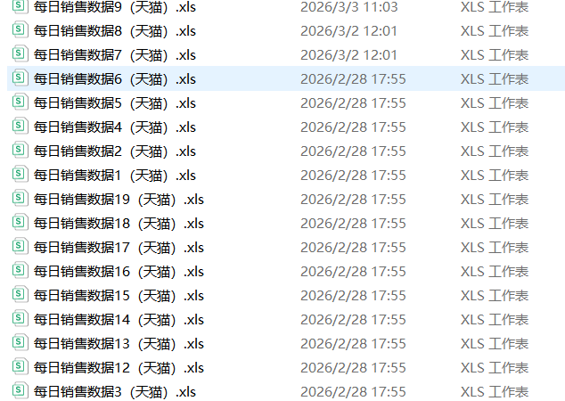
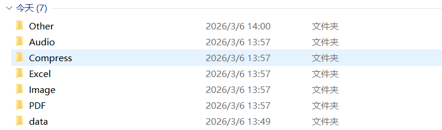

# Python 批量重命名 / 整理文件

日常工作中，我们总会遇到大量文件需要整理：杂乱无章的下载文件夹、一堆命名混乱的报表、不同类型的文件混在一起…… 手动重命名、分类不仅耗时，还容易出错。今天就分享一套实用的 Python 脚本，一键实现文件批量重命名、按类型自动整理、清理空文件夹，彻底告别手动操作！





## 一、核心功能介绍

这套脚本基于 Python 内置库开发（无需额外安装依赖），包含 3 个核心功能，覆盖文件管理高频场景：

1. **批量重命名文件**：支持自定义前缀 / 后缀、按序号命名，自动避免文件名重复；
2. **按类型整理文件**：自动识别文件格式（Excel、图片、视频等），分类到对应文件夹；
3. **清理空文件夹**：递归删除整理后产生的冗余空目录，保持文件夹整洁。

## 二、完整代码实现

```python
import os
import shutil
from pathlib import Path

def batch_rename_files(
    folder_path: str,
    prefix: str = "file",
    suffix: str = "",
    start_num: int = 1,
    file_ext: str = "*"
) -> None:
    """
    批量重命名文件夹下的文件
    :param folder_path: 目标文件夹路径
    :param prefix: 文件名前缀（默认：file）
    :param suffix: 文件名后缀（默认：空）
    :param start_num: 序号起始值（默认：1）
    :param file_ext: 指定文件类型（如 ".xlsx"，* 表示所有文件）
    """
    # 校验文件夹是否存在
    if not os.path.exists(folder_path):
        print(f"错误：文件夹 {folder_path} 不存在！")
        return
    
    # 转换为 Path 对象，方便路径处理
    folder = Path(folder_path)
    # 获取目标文件列表
    if file_ext == "*":
        file_list = [f for f in folder.iterdir() if f.is_file()]
    else:
        file_list = list(folder.glob(f"*{file_ext}"))
    
    if not file_list:
        print(f"未找到 {file_ext} 类型的文件！")
        return
    
    # 批量重命名
    for idx, file in enumerate(file_list, start=start_num):
        # 保留原文件扩展名
        ext = file.suffix
        # 新文件名：前缀 + 序号 + 后缀 + 扩展名
        new_name = f"{prefix}{idx}{suffix}{ext}"
        new_path = folder / new_name
        
        # 避免文件名重复（如果已存在则加 _1、_2...）
        count = 1
        while new_path.exists():
            new_name = f"{prefix}{idx}{suffix}_{count}{ext}"
            new_path = folder / new_name
            count += 1
        
        # 执行重命名
        file.rename(new_path)
        print(f"重命名成功：{file.name} → {new_name}")

def organize_files_by_type(folder_path: str) -> None:
    """
    按文件类型自动整理文件到对应文件夹
    :param folder_path: 目标文件夹路径
    """
    if not os.path.exists(folder_path):
        print(f"错误：文件夹 {folder_path} 不存在！")
        return
    
    folder = Path(folder_path)
    # 定义文件类型与目标文件夹的映射（可根据需求扩展）
    file_type_mapping = {
        # 办公文档
        "Excel": [".xlsx", ".xls", ".csv"],
        "Word": [".docx", ".doc"],
        "PPT": [".pptx", ".ppt"],
        "PDF": [".pdf"],
        # 图片
        "Image": [".jpg", ".jpeg", ".png", ".gif", ".bmp"],
        # 视频
        "Video": [".mp4", ".avi", ".mov", ".mkv"],
        # 音频
        "Audio": [".mp3", ".wav", ".flac"],
        # 压缩包
        "Compress": [".zip", ".rar", ".7z"],
        # 代码文件
        "Code": [".py", ".java", ".cpp", ".js", ".html"],
        # 其他文件
        "Other": []
    }

    # 遍历文件夹下的所有文件（不含子文件夹）
    for file in folder.iterdir():
        if file.is_file():
            # 获取文件扩展名（小写，避免大小写问题）
            ext = file.suffix.lower()
            target_folder = "Other"
            
            # 匹配文件类型
            for folder_name, ext_list in file_type_mapping.items():
                if ext in [e.lower() for e in ext_list]:
                    target_folder = folder_name
                    break
            
            # 创建目标文件夹（如果不存在）
            target_path = folder / target_folder
            target_path.mkdir(exist_ok=True)
            
            # 移动文件（避免重复，重复则加序号）
            new_file_path = target_path / file.name
            count = 1
            while new_file_path.exists():
                new_name = f"{file.stem}_{count}{ext}"
                new_file_path = target_path / new_name
                count += 1
            
            shutil.move(str(file), str(new_file_path))
            print(f"整理成功：{file.name} → {target_folder}/{new_file_path.name}")

def clean_empty_folders(folder_path: str) -> None:
    """
    递归删除空文件夹
    :param folder_path: 目标文件夹路径
    """
    if not os.path.exists(folder_path):
        print(f"错误：文件夹 {folder_path} 不存在！")
        return
    
    # 递归遍历子文件夹（从最深层开始删除）
    for root, dirs, files in os.walk(folder_path, topdown=False):
        for dir_name in dirs:
            dir_path = os.path.join(root, dir_name)
            # 判断文件夹是否为空
            if not os.listdir(dir_path):
                os.rmdir(dir_path)
                print(f"删除空文件夹：{dir_path}")

# ===================== 测试/使用示例 =====================
if __name__ == "__main__":
    # 请修改为你的目标文件夹路径（Windows 路径用 \\ 或 /，Mac/Linux 用 /）
    target_folder = r"C:\\Users\\xxx\\Downloads"
    
    # 示例1：批量重命名所有 Excel 文件
    # batch_rename_files(
    #     folder_path=target_folder,
    #     prefix="每日销售数据",
    #     suffix="（天猫）",
    #     start_num=1,
    #     file_ext=".xls"
    # )
    
    # 示例2：按文件类型自动整理
    # organize_files_by_type(target_folder)
    
    # 示例3：清理整理后产生的空文件夹
    # clean_empty_folders(target_folder)
```

## 三、使用教程（新手友好）

### 1. 环境准备

无需安装任何第三方库！脚本仅使用 Python 内置的 `os`（系统路径）、`shutil`（文件操作）、`pathlib`（路径处理），Python 3.4 及以上版本均可直接运行。

### 2. 核心参数说明

#### （1）批量重命名功能

```
batch_rename_files(
    folder_path="你的文件夹路径",  # 必改！如 r"C:\桌面\文件"
    prefix="月度报表",             # 文件名前缀，如「月度报表」
    suffix="2026",                # 文件名后缀，如「2026」
    start_num=1,                  # 序号起始值，如从1开始
    file_ext=".xls"              # 只处理Excel文件，*表示所有文件
)
```

**效果**：将文件夹内的 Excel 文件重命名为「月度报表 12026.xlsx」「月度报表 22026.xlsx」……

#### （2）按类型整理功能

```
organize_files_by_type(folder_path="你的文件夹路径")
```

**效果**：自动创建「Excel」「Image」「Video」等文件夹，将对应类型的文件移动进去，避免文件杂乱。

#### （3）清理空文件夹功能

```
clean_empty_folders(folder_path="你的文件夹路径")
```

**效果**：递归删除文件夹下所有空目录（包括子文件夹里的空目录），整理后更整洁。

### 3. 运行步骤

1. 复制上述代码到 Python 编辑器（如 VS Code、PyCharm）；
2. 修改 `target_folder` 为你要处理的文件夹路径（Windows 路径建议加 `r` 避免转义）；
3. 取消对应功能的注释（删掉行首的 `#`）；
4. 运行代码，控制台会输出每一步的操作结果。

## 四、避坑指南（新手必看）

1. **路径格式问题**：

   

   - Windows 系统路径：用 `r"C:\Users\XXX\Desktop\文件"`（加 `r` 防止反斜杠转义），或把反斜杠换成正斜杠 `C:/Users/XXX/Desktop/文件`；
   - Mac/Linux 系统路径：直接用 `/Users/XXX/Desktop/文件`。

   

2. **文件重复问题**：

   脚本已内置「重复文件名处理逻辑」—— 如果目标文件名已存在，会自动加 `_1`「_2」后缀，避免覆盖文件。

   

3. **安全提示**：

   

   - 执行前建议**备份重要文件**，避免误操作；
   - 不要在系统文件夹（如 C:\Windows）运行，仅处理自己的文件；
   - 重命名仅修改文件名，不会改变文件格式和内容。

   

## 五、扩展玩法

1. 自定义文件分类

   可添加自定义类型

   ```
   "Note": [".md", ".txt"],
   ```

2. **批量处理子文件夹**：在 `organize_files_by_type` 函数中，将 `folder.iterdir()` 改为 `folder.rglob("*")`，并判断 `file.is_file()`，即可处理所有子文件夹的文件；

3. **定时自动整理**：结合 `schedule` 库，可实现每天定时整理指定文件夹（如下班前自动整理下载文件夹）。

## 六、总结

这套脚本用最简洁的代码实现了文件管理的核心需求，无需复杂的语法，新手也能快速上手。无论是整理工作报表、清理下载文件夹，还是批量重命名项目文件，都能一键搞定，大幅提升工作效率。