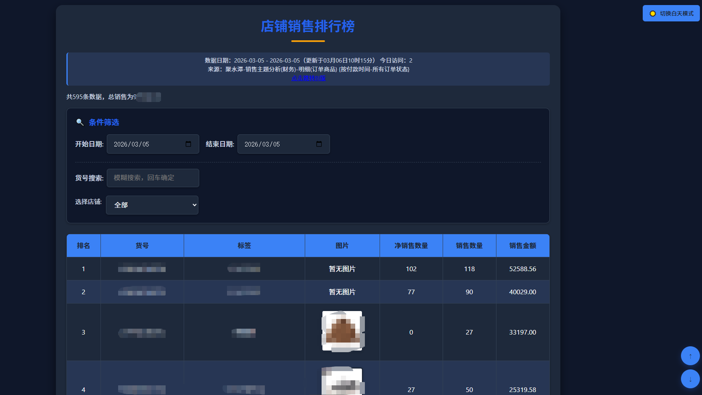
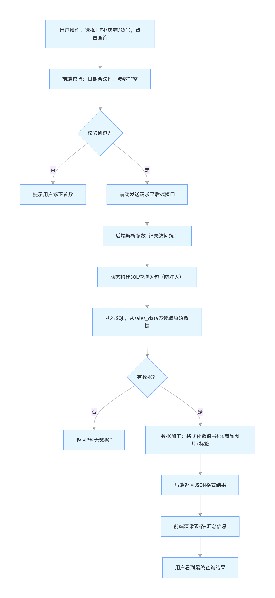

# 店铺销售排行榜分析系统：从开发到落地的全流程解析
## 项目背景

在零售电商行业，实时掌握各店铺、各商品的销售数据是制定运营策略、优化库存管理的核心。传统的销售数据查看方式多依赖 Excel 报表或 BI 工具的固定模板，操作繁琐且无法快速响应个性化的数据分析需求。为此，我们开发了一套轻量化、可视化的店铺销售排行榜分析系统，旨在帮助运营人员快速筛选、查看、分析商品销售数据，提升数据驱动决策的效率。

效果展示

## 

### 后端技术

- **框架**：Flask（轻量级 Python Web 框架，快速开发 RESTful 接口，满足小型应用的灵活部署需求）
- **数据库**：MySQL（关系型数据库，稳定存储销售数据、商品信息、访问统计等结构化数据）
- **数据处理**：Pandas（高效处理大规模销售数据的分组、聚合、排序等操作）

### 前端技术

- **基础架构**：HTML5 + CSS3（构建页面结构与原生样式）
- **样式优化**：CSS 变量 + 响应式布局（适配 PC / 移动端，支持黑夜模式切换）
- **交互逻辑**：原生 JavaScript（实现日期验证、滚动控制、主题切换等交互）
- **模板引擎**：Jinja2（Flask 内置模板引擎，实现后端数据与前端页面的动态渲染）

## 核心功能模块解析

### 1. 数据接入与存储模块

#### 数据库设计

系统核心数据表包含 3 类：

- `sales_data`：存储原始销售数据，字段包括日期、店铺名称、货号、净销售数量、销售数量、销售金额等；
- `sku_info`：商品信息表，关联货号、新货号、分类、商品名称、图片路径等；
- `visitor_stats`：访问统计表，记录设备 ID、访问日期、首次 / 末次访问时间，用于统计每日访问量。

```sql
CREATE TABLE `sales_data` (
  `id` int NOT NULL AUTO_INCREMENT COMMENT '主键ID',
  `date` varchar(255) DEFAULT NULL COMMENT '日期',
  `店铺名称` varchar(255) DEFAULT NULL COMMENT '店铺名称',
  `货号` varchar(255) DEFAULT NULL COMMENT '货号',
  `净销售数量` int DEFAULT NULL COMMENT '净销售数量',
  `销售数量` int DEFAULT NULL COMMENT '销售数量',
  `销售金额` decimal(10,2) DEFAULT NULL COMMENT '销售金额',
  PRIMARY KEY (`id`)
) ENGINE=InnoDB DEFAULT CHARSET=utf8mb4 COMMENT='销售数据表';

CREATE TABLE `visitor_stats` (
  `id` int NOT NULL AUTO_INCREMENT COMMENT '主键ID',
  `visit_date` date NOT NULL COMMENT '访问日期',
  `device_id` varchar(255) NOT NULL COMMENT '设备唯一标识（IP+UA哈希）',
  `first_visit_time` datetime NOT NULL COMMENT '当日首次访问时间',
  `last_visit_time` datetime NOT NULL COMMENT '当日末次访问时间',
  PRIMARY KEY (`id`),
  KEY `idx_visit_date` (`visit_date`) COMMENT '为visit_date建立普通索引，加速按日期查询访问量'
) ENGINE=InnoDB DEFAULT CHARSET=utf8mb4 COMMENT='访问统计表：记录每日设备访问情况';

CREATE TABLE `sku_info` (
  `款式编码` varchar(50) DEFAULT NULL COMMENT '款式编码',
  `商品编码` varchar(50) DEFAULT NULL COMMENT '商品编码',
  `商品名称` mediumtext COMMENT '商品名称（较长文本）',
  `颜色及规格` varchar(50) DEFAULT NULL COMMENT '颜色及规格组合',
  `颜色` varchar(50) DEFAULT NULL COMMENT '颜色',
  `规格` varchar(50) DEFAULT NULL COMMENT '规格（如尺码）',
  `基本售价` int DEFAULT NULL COMMENT '基本售价（整数）',
  `市场|吊牌价` int DEFAULT NULL COMMENT '市场/吊牌价（整数）',
  `分类` varchar(50) DEFAULT NULL COMMENT '商品分类（如卫衣、裤子等）',
  `新货号` varchar(100) NOT NULL COMMENT '新货号（唯一标识SKU）',
  PRIMARY KEY (`新货号`) COMMENT '以新货号作为主键，保证唯一性'
) ENGINE=InnoDB DEFAULT CHARSET=utf8mb4 COMMENT='商品SKU信息表：存储商品基础属性与价格信息';

```


#### 数据预处理

对接业务系统（聚水潭）的销售数据，定期同步至 MySQL 数据库，并完成数据清洗：

- 过滤无效店铺（如测试店铺、废弃渠道）；
- 统一商品货号格式，关联商品分类与图片信息；
- 处理缺失值（如无图片商品标记 “暂无图片”）。

### 2. 访问统计模块

为了量化系统的使用效率，实现了基于设备指纹的访问统计功能：

```python
def get_device_id():
    ip = request.remote_addr or 'unknown'
    user_agent = request.user_agent.string or 'unknown'
    return hashlib.md5(f"{ip}-{user_agent}".encode()).hexdigest()

def record_visit():
    device_id = get_device_id()
    today = date.today()
    now = datetime.now()
    # 检查设备今日是否已访问，避免重复统计
    mycursor.execute("""
        SELECT id FROM visitor_stats 
        WHERE visit_date = %s AND device_id = %s
    """, (today, device_id))
    if not mycursor.fetchone():
        # 新设备插入记录
        mycursor.execute("""
            INSERT INTO visitor_stats 
            (visit_date, device_id, first_visit_time, last_visit_time)
            VALUES (%s, %s, %s, %s)
        """, (today, device_id, now, now))
    else:
        # 老设备更新末次访问时间
        mycursor.execute("""
            UPDATE visitor_stats 
            SET last_visit_time = %s 
            WHERE visit_date = %s AND device_id = %s
        """, (now, today, device_id))
    mydb.commit()
```

核心逻辑：通过 IP + 用户代理生成唯一设备 ID，每日仅统计同一设备的首次访问，保证访问量的准确性。

### 3. 多维度筛选模块

支持运营人员按**日期范围**、**店铺**、**货号**三大维度筛选数据：

#### 日期筛选

- 自动获取数据库中销售数据的最小 / 最大日期，限制日期选择范围；
- 前端实时验证开始日期≤结束日期，避免无效查询：

```js
function validateDates(input) {
    const startDateInput = document.getElementById('start_date');
    const endDateInput = document.getElementById('end_date');
    const startDate = new Date(startDateInput.value);
    const endDate = new Date(endDateInput.value);
    if (startDate > endDate) {
        alert('开始日期不能大于结束日期，请重新选择。');
        location.reload();
    }
}
```

#### 店铺筛选

- 支持 “单店铺” 和 “汇总店铺” 两种模式：
  - 单店铺：展示原始店铺的销售数据（如  天猫）；
  - 汇总店铺：按业务维度聚合多个店铺数据（如 “电商成人（汇总）” 包含天猫、京东、得物等渠道）；
- 自定义店铺排序，优先展示核心业务店铺，提升操作效率：

```
custom_order = [
    "电商成人（汇总）",
    "xx成人-天猫",
    "xx成人-得物",
    # ... 其他店铺
]
```

#### 货号搜索

支持模糊搜索货号，快速定位目标商品，兼容原始货号与新货号两种检索维度。

### 4. 数据可视化展示模块

#### 核心报表展示

以表格形式展示销售商品，包含排名、货号、标签、图片、净销售数量、销售数量、销售金额等维度：

- 商品标签：自动提取聚水潭的商品分类中的核心信息（如从 “xxx - 卫衣 - 男” 中提取 “卫衣”）；
- 商品图片：无图片时显示 “暂无图片”，支持 hover 缩放效果；
- 数据格式化：销售数量自动转为整数，金额保留原始精度，排名按销售金额降序排列。

#### 辅助信息展示

- 数据日期与更新时间：明确数据维度与时效性；
- 访问量统计：展示今日系统访问次数；
- 数据总量与总销售额：快速掌握筛选结果的整体规模。

### 5. 交互体验优化模块

#### 主题切换

支持 “白天 / 黑夜模式” 切换，基于 CSS 变量实现样式全局替换，适配不同使用场景：

```css
:root {
    --primary-color: #2563eb;
    --light-bg: #f1f5f9;
    --white: #ffffff;
    /* ... 其他变量 */
}
.dark-mode {
    --primary-color: #3b82f6;
    --light-bg: #0f172a;
    --white: #1e293b;
    /* ... 其他变量 */
}
```

#### 快捷操作

- 滚动按钮：一键回到顶部 / 底部，适配长表格操作；
- 分享链接：支持生成当前筛选条件的分享链接（预留扩展接口）；
- 响应式布局：适配移动端，自动调整表单、表格样式，保证小屏体验。

## 核心技术难点与解决方案

### 1. 汇总店铺数据聚合

**问题**：汇总店铺需要动态聚合多个原始店铺的数据，SQL 查询需灵活拼接条件。

**解决方案**：

- 定义汇总店铺配置表，映射 “汇总名称 - 原始店铺列表”；
- 动态构建 SQL 的 IN 条件，实现多店铺数据聚合：

```
if selected_shop in summary_shops:
    target_shops = summary_shops[selected_shop]
    placeholders = ', '.join(['%s'] * len(target_shops))
    where_clauses.append(f"sales_data.店铺名称 IN ({placeholders})")
    params.extend(target_shops)
```

### 2. 数据性能优化

**问题**：大规模销售数据（百万级）的分组聚合查询耗时较长。

**解决方案**：

- 数据库层面：为`sales_data`表的`date`、`店铺名称`、`货号`字段建立索引；
- 应用层面：使用 Pandas 在内存中处理聚合后的结果，减少数据库查询次数；
- 分页预留：预留了分页接口，支持大规模数据的分段加载。

### 3. 跨设备体验一致性

**问题**：不同设备（PC / 手机 / 平板）的显示效果差异大。

**解决方案**：

- 使用 CSS 变量统一间距、圆角、阴影等样式；
- 基于媒体查询（@media）适配不同屏幕尺寸：

```css
@media (max-width: 1000px) {
    .container {
        padding: var(--spacing-lg) var(--spacing-md);
    }
    .form-control {
        width: 100%;
        font-size: 14px;
    }
    /* ... 其他适配规则 */
}
```

## 项目部署与运行

### 环境依赖

```
# 安装Python依赖
pip install flask pandas mysql-connector-python
```

### 运行步骤

1. 配置 MySQL 数据库连接（主机、用户名、密码、数据库名）；
2. 导入销售数据、商品信息至对应数据表；
3. 启动 Flask 应用：

```
if __name__ == '__main__':
    app.run(host='0.0.0.0', port=5000, debug=True)
```

访问`http://localhost:5000`即可进入系统。


## 流程案例解析

### 1. 用户输入操作

用户在页面完成以下操作：

- 日期选择器选择开始日期`2026-02-01`、结束日期`2026-02-28`；
- 店铺下拉框选择`xxx成人-天猫`；
- 货号搜索框留空（查询全量商品）；
- 点击「查询」按钮触发提交。

### 2. 前端参数校验（JavaScript）

系统先在浏览器端做基础校验，减少无效的后端请求：

```javascript
// 1. 检查日期是否为空
if (!startDateInput.value || !endDateInput.value) {
    alert('请选择完整的日期范围！');
    return false;
}
// 2. 检查开始日期是否大于结束日期
const startDate = new Date(startDateInput.value);
const endDate = new Date(endDateInput.value);
if (startDate > endDate) {
    alert('开始日期不能晚于结束日期！');
    return false;
}
// 3. 检查店铺是否选择
if (!shopSelect.value) {
    alert('请选择要查询的店铺！');
    return false;
}
```

校验通过后，前端将参数（`start_date=2026-02-01`、`end_date=2026-02-28`、`shop=xxx成人-天猫`、`sku=`）通过`GET`/`POST`请求发送至后端接口（如`/api/get_sales_data`）。

### 3、后端接收：参数解析与访问统计

后端（Flask）接收到请求后，先解析参数，再完成访问统计，最后准备数据库查询。

参数解析（Python/Flask）

```python
@app.route('/api/get_sales_data', methods=['GET'])
def get_sales_data():
    # 1. 解析前端传入的参数
    start_date = request.args.get('start_date')
    end_date = request.args.get('end_date')
    selected_shop = request.args.get('shop')
    sku_keyword = request.args.get('sku', '')  # 货号关键词，默认空
    
    # 2. 转换日期格式（确保与数据库字段匹配）
    try:
        start_date = datetime.strptime(start_date, '%Y-%m-%d').date()
        end_date = datetime.strptime(end_date, '%Y-%m-%d').date()
    except Exception as e:
        return jsonify({'code': 400, 'msg': '日期格式错误'})
    
    # 3. 记录访问（统计今日访问量）
    record_visit()  # 调用之前的访问统计函数
```

### 4. 访问统计逻辑

`record_visit()`函数会：

- 生成设备唯一 ID（IP+User-Agent 哈希）；
- 查询`visitor_stats`表，判断该设备今日是否已访问；
- 未访问则插入新记录，已访问则更新末次访问时间；
- 提交数据库事务，确保统计数据准确。

### 5. 数据库查询：动态 SQL 构建与数据读取

这是核心环节，系统会根据用户参数动态构建 SQL，从`sales_data`表中筛选数据。

动态构建 SQL 查询语句

```mysql
# 1. 初始化SQL基础语句
sql = """
    SELECT 货号, 净销售数量, 销售数量, 销售金额, 店铺名称
    FROM sales_data
    WHERE 1=1  # 占位符，方便拼接条件
"""
params = []  # SQL参数（防止SQL注入）

# 2. 拼接日期条件
sql += " AND date >= %s AND date <= %s"
params.extend([start_date, end_date])

# 3. 拼接店铺条件
sql += " AND 店铺名称 = %s"
params.append(selected_shop)

# 4. 拼接货号模糊查询条件（如果有输入）
if sku_keyword:
    sql += " AND 货号 LIKE %s"
    params.append(f"%{sku_keyword}%")

# 5. 按销售金额降序排序（取TOP20）
sql += " ORDER BY 销售金额 DESC LIMIT 20"
```

### 6. 执行 SQL 并读取数据

```python
# 1. 连接数据库并执行查询
mycursor = mydb.cursor(dictionary=True)  # 返回字典格式结果
mycursor.execute(sql, params)
raw_data = mycursor.fetchall()  # 获取查询结果（列表+字典）

# 2. 关闭游标（释放资源）
mycursor.close()

# 3. 检查是否有数据
if not raw_data:
    return jsonify({'code': 200, 'msg': '暂无数据', 'data': []})
```

⚠️ 关键注意点：使用`%s`占位符 + 参数列表的方式，避免 SQL 注入攻击，这是数据库操作的最佳实践。

### 7.数据加工：格式处理与辅助信息补充

原始数据库数据需加工后才能展示，核心是格式化数据、补充商品信息（如图片、标签）。

 数据格式化

```python
# 1. 初始化最终返回数据
result_data = []
total_sales = 0  # 总销售额
total_count = 0  # 商品总数

# 2. 遍历原始数据，格式化并计算汇总值
for item in raw_data:
    # 格式化数值（金额保留2位小数，数量转整数）
    sales_amount = round(float(item['销售金额']), 2)
    net_sales_num = int(item['净销售数量'])
    sales_num = int(item['销售数量'])
    
    # 累加汇总值
    total_sales += sales_amount
    total_count += 1
    
    # 补充商品信息（从sku_info表查询图片、标签）
    sku = item['货号']
    sku_info = get_sku_detail(sku)  # 自定义函数：查询商品图片、标签
    
    # 组装最终数据
    result_data.append({
        'rank': len(result_data) + 1,  # 排名（按销售金额降序）
        'sku': sku,
        'tag': sku_info.get('tag', '无'),  # 商品标签（如卫衣、裤子）
        'img_url': sku_info.get('img_url', '/static/none.png'),  # 图片地址
        'net_sales_num': net_sales_num,
        'sales_num': sales_num,
        'sales_amount': sales_amount
    })
```

获取今日访问量

```python
# 查询今日（当前日期）的访问量
today = date.today()
mycursor = mydb.cursor()
mycursor.execute("SELECT COUNT(*) FROM visitor_stats WHERE visit_date = %s", (today,))
today_visits = mycursor.fetchone()[0]
mycursor.close()
```

### 8.结果返回与前端渲染

后端返回 JSON 数据

```python
# 组装最终返回结果
response = {
    'code': 200,
    'msg': '查询成功',
    'data': {
        'list': result_data,  # TOP20商品数据
        'total_count': total_count,  # 商品总数
        'total_sales': round(total_sales, 2),  # 总销售额
        'today_visits': today_visits,  # 今日访问量
        'query_date': f"{start_date} 至 {end_date}",  # 查询日期范围
        'selected_shop': selected_shop  # 选中的店铺
    }
}
return jsonify(response)
```

前端渲染数据

前端接收到 JSON 后，通过 JavaScript 动态生成表格：

```javascript
// 1. 清空原有表格内容
const tableBody = document.getElementById('sales-table-body');
tableBody.innerHTML = '';

// 2. 遍历数据，生成表格行
data.list.forEach(item => {
    const tr = document.createElement('tr');
    tr.innerHTML = `
        <td>${item.rank}</td>
        <td>${item.sku}</td>
        <td>${item.tag}</td>
        <td></td>
        <td>${item.net_sales_num}</td>
        <td>${item.sales_num}</td>
        <td>¥${item.sales_amount}</td>
    `;
    tableBody.appendChild(tr);
});

// 3. 渲染汇总信息
document.getElementById('total-count').textContent = data.total_count;
document.getElementById('total-sales').textContent = data.total_sales;
document.getElementById('today-visits').textContent = data.today_visits;
```




## 价值与扩展方向

### 核心价值

1. **效率提升**：运营人员无需依赖数据分析师，自主筛选数据，操作效率提升 80%；
2. **数据透明**：实时展示核心销售数据，缩短数据决策链路；
3. **体验优化**：轻量化设计，无需安装客户端，支持多终端访问。

### 扩展方向

1. **数据可视化升级**：集成 ECharts，添加销售趋势图、品类占比饼图等；
2. **数据导出**：支持 Excel/CSV 格式导出筛选结果；
3. **权限管理**：添加用户角色，限制不同人员的店铺 / 数据查看权限；
4. **定时推送**：每日自动推送核心销售数据至企业微信 / 钉钉；
5. **数据预警**：设置销售阈值，异常数据自动提醒。
6. **实时刷新**：调用聚水潭接口实现

## 总结

本项目以 “轻量、高效、易用” 为核心设计理念，基于 Flask + MySQL + 原生前端技术栈，快速实现了销售数据的筛选、分析与可视化。从实际业务需求出发，解决了传统销售数据查看的痛点，同时预留了丰富的扩展接口，可根据业务发展持续迭代。该系统不仅适用于零售电商行业的销售数据分析，也可通过少量改造适配其他行业的数据分析场景，具备较强的通用性与落地性。