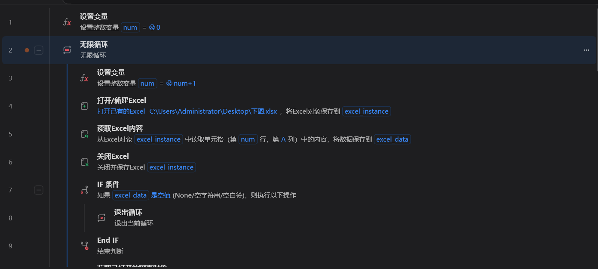
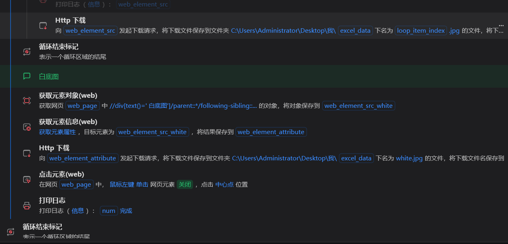
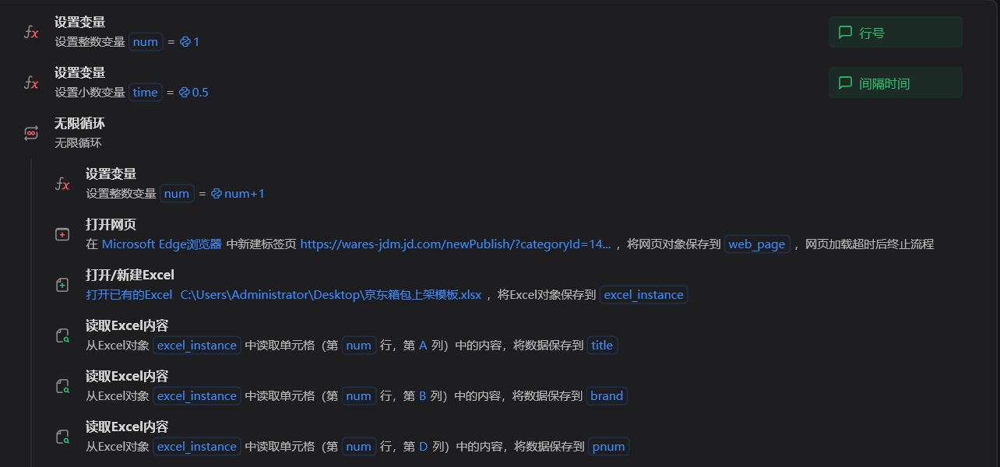

# RPA——自动铺货

## 项目背景

作为一名电商运营，由于品类原因铺货上架的量非常大，每天重复性工作占比很大，所以想要简化工作。

## 项目思路

使用纯Python代码的形式理论上也能实现，但是难度较大，也不方便，使用rpa这种现成的工具显然更合适。

学习过几个rpa，发现还是影刀rpa最好用，大多数场景免费版已经足够。

各类目、平台原理大致相同，操作细节需要分别定制，曾实现平台：淘宝天猫、天猫国际、京东、闲鱼（手机）等

**具体思路**

1. 上架需要用到的图片和资料都是在公司的系统上的，很多还是在二级页面上，先用rpa反复模拟点击，把信息获取下来，存到表格里
2. 把表格信息和图片检查一下，就开始用rpa模拟自动上架了

## 三、项目实战：分模块搭建自动化流程

### 模块1：自动下载商品资料

根据货号获取系统里的商品资料，包括图片等

### 模块2：根据表格信息自动上架

需要手动整理一下excel里的信息（有部分需要人工调整）

读取完数据后，模拟人工进行操作，基本上以输入、点击、上传图片操作为主

最后加上循环操作，就可以实现自动铺货上架了