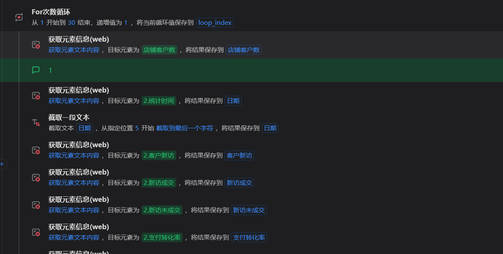
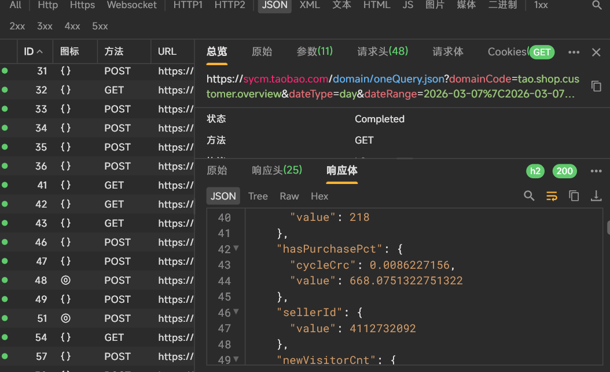
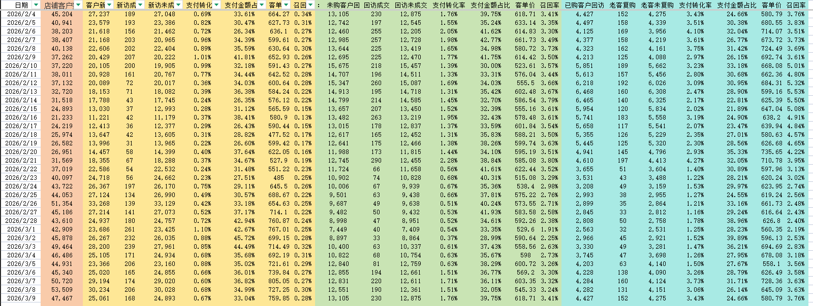
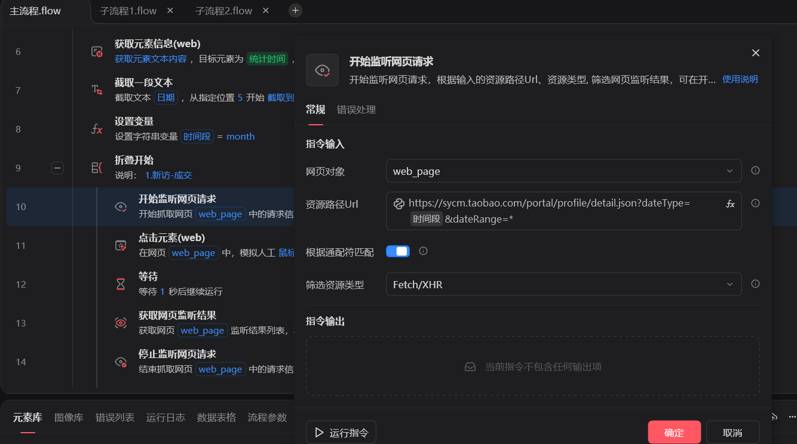
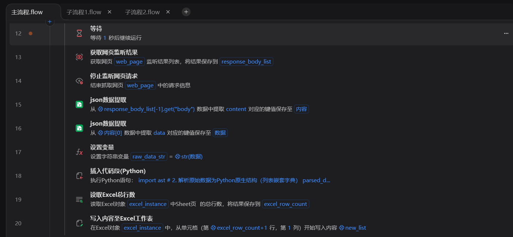
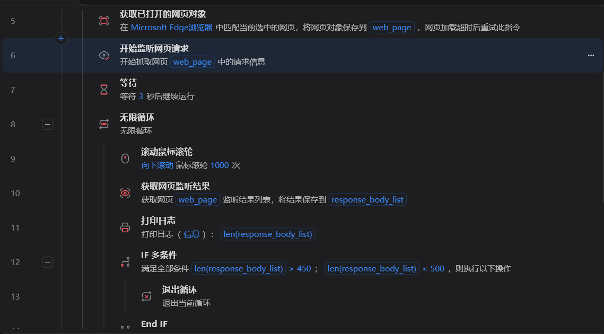

# RPA——抓取各种数据

## 项目背景

由于天猫生意参谋上的数据非常多，而且有一些并没有提供下载渠道。

比如“客户——客户概况”、“商品——商品360——每天sku的数据”、

## 项目思路

一般会先看一下后台请求的响应数据，json格式，看看想获取到的数据有没有在里面。

在的话可以看能否直接发送请求来获取到响应（爬虫），一般大型网站不太行，那就使用监听请求的方式，然后解析json数据。

也可以直接利用影刀来抓取数据，一般来说效果一样，所见即所得，更加直观。

## 三、项目实战：分模块搭建自动化流程

### 模块1：客户概况的数据

影刀直接抓取

### 模块2：客户概况的数据

通过监听请求来获取数据

