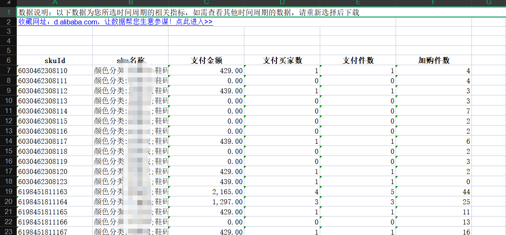
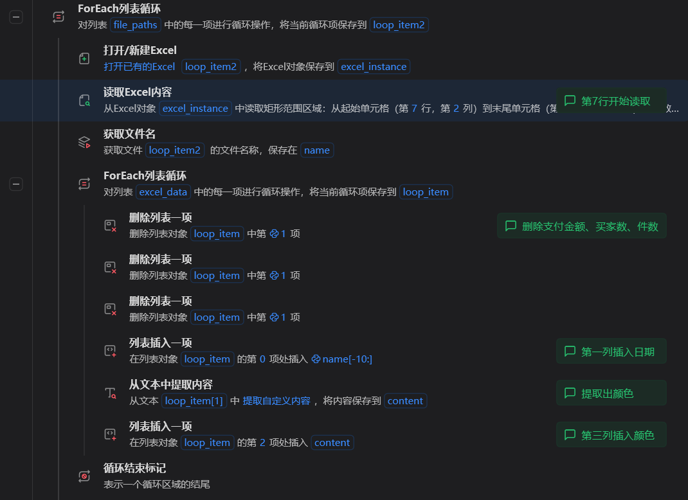
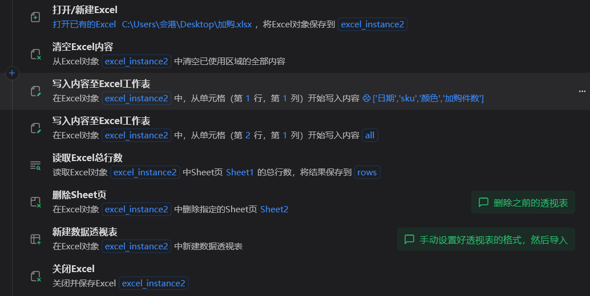
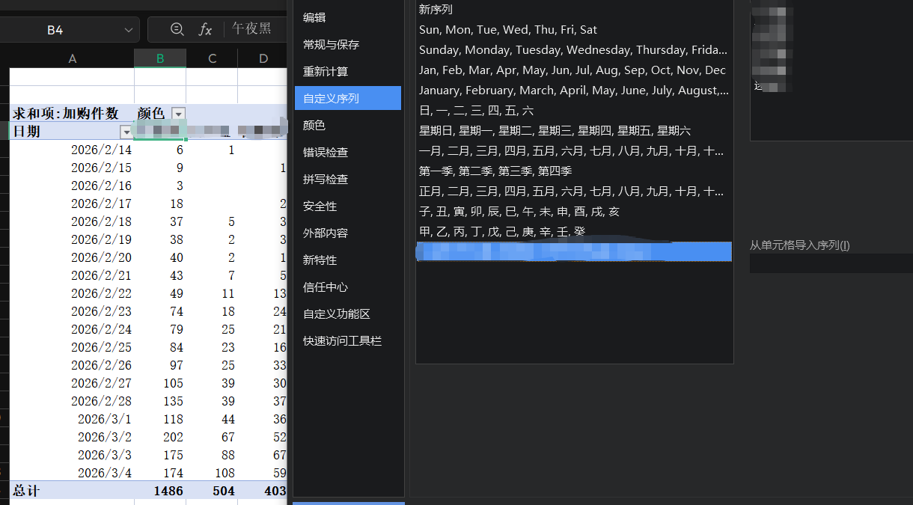
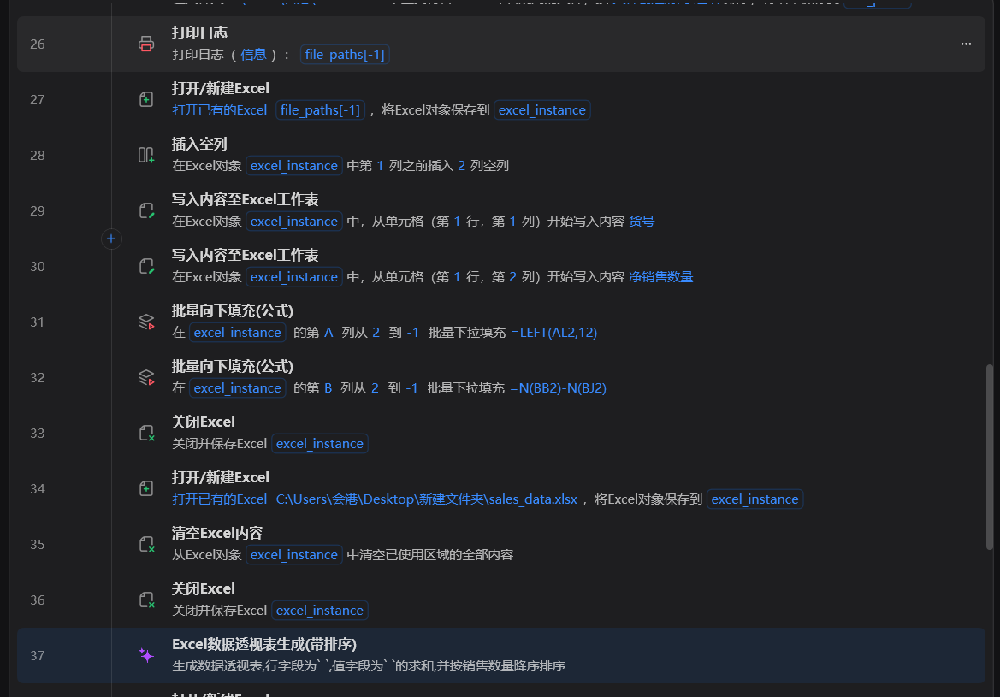
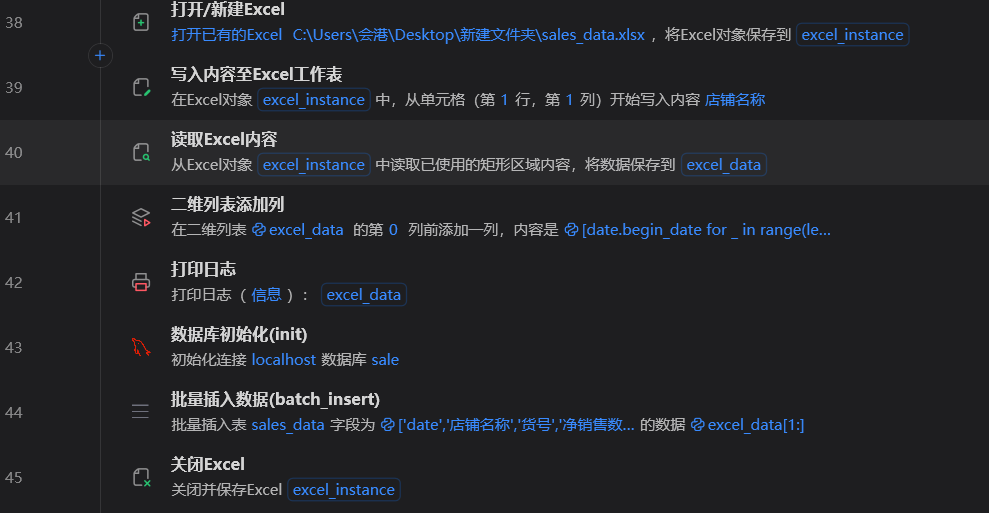

# RPA——Excel处理

## 项目背景

简单的处理使用Python代码的方式同样可以实现，但是使用rpa来进行处理显然更加方便，而且可以进行几乎所有的人工操作

## 项目思路

和操作网页一样，需要先知道手动怎么处理，然后一步步搭建

## 项目实战

### 模块1：合并并处理数据

比如在之前的项目中处理过的这个sku销售和加购数据，使用rpa处理起来会更加方便，循环读取，然后写入空白文件，最后新建数据透视表处理。

有个难点是想要数据透视后的列按自定义的顺序排序，就先要在wps里创建自定义的序列，然后按照这个序列排序

### 模块2：清洗数据，并插入数据库

数据太多的时候，应该使用数据库。比如从聚水潭导出前一天的数据后，需要进行清洗（算出净销售等数据）和合并（相同的货号和店铺进行合并），这里用到的是影刀的魔法指令，相当于用对话的形式，让ai生成Python代码进行运行，也就是同等于上一个模块使用普通指令的作用。

然后使用指令进行数据库的操作

