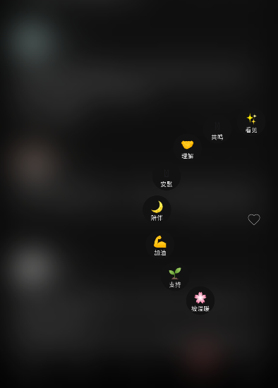
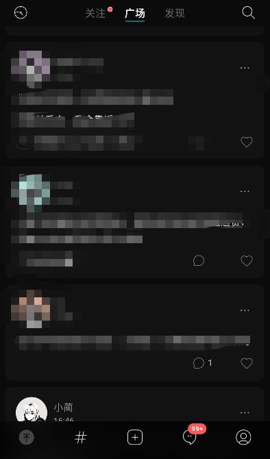
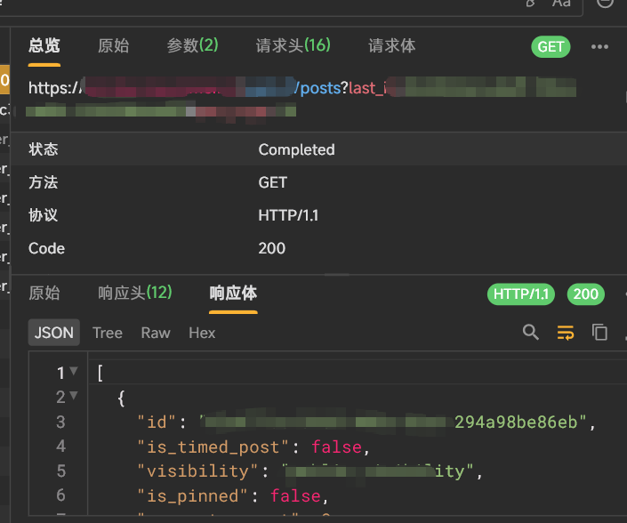
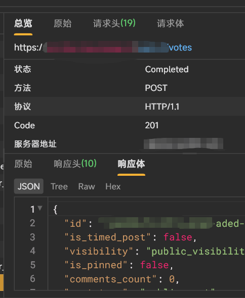
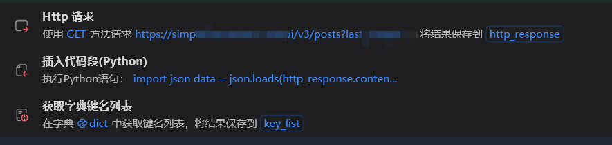
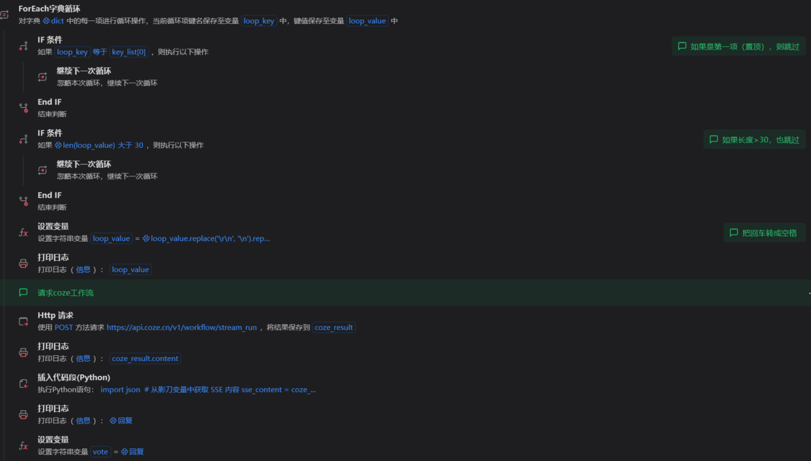
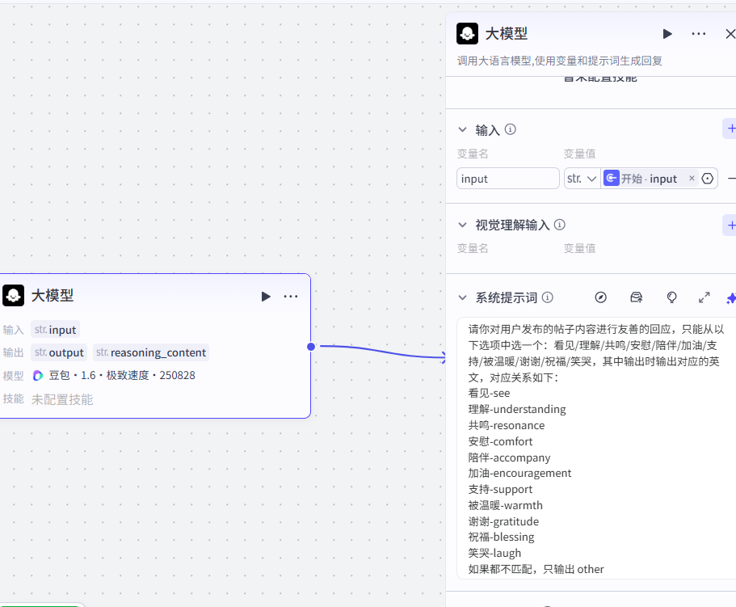
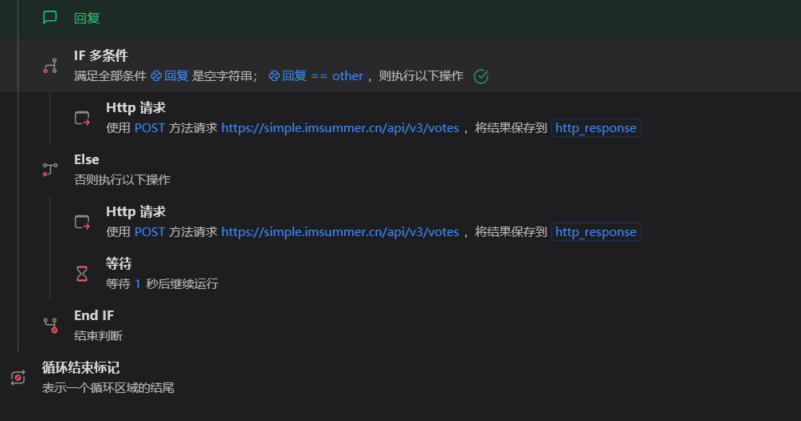

# RPA——点赞和评论机器人

## 项目背景

一个平台的帖子有非常多，如果想要进行互动的话需要耗费大量时间。

（某些平台有反爬机制，不好实现）这时候，我们发送请求获取到帖子的内容，然后交给AI（比如coze工作流，使用一个大模型模块对其进行处理），比如生成回复，再把回复传回到rpa里，发送评论的请求，从而对该帖子进行评论

## 项目思路

先用抓包工具抓取获取帖子的请求、发送点赞和评论的请求，找到规律

发现点赞和评论依据的是用户的信息和帖子的id，用户的信息短时间内不会改变

所以先在影刀里先发送获取帖子内容的请求，得到id和内容的字典

把内容通过事先设置好的**coze工作流**里的大模型模块，输出出来应该点赞或者评论的内容

最后根据相应id发送点赞或评论的请求。

## 项目实战

### 这里以某app的点赞为例（点赞有多种），与评论功能类似





首先进行抓包，下面分别是动态和点赞的请求





然后在影刀请求完，将响应里需要的id和内容放进字典



```python
import json
data = json.loads(http_response.content)
dict = {item['id']: item['content'] for item in data}
```

然后遍历这个字典，除了两种特殊情况，分别是第一条（为置顶的跳过）和字数太多的（怕消耗太多token），其他的请求coze工作流



需要提前配置好coze工作流的流程、workflow_id、访问令牌，并测试，确保效果满足



最后可以简单判断返回的内容，然后发送点赞的请求，完成一个循环

